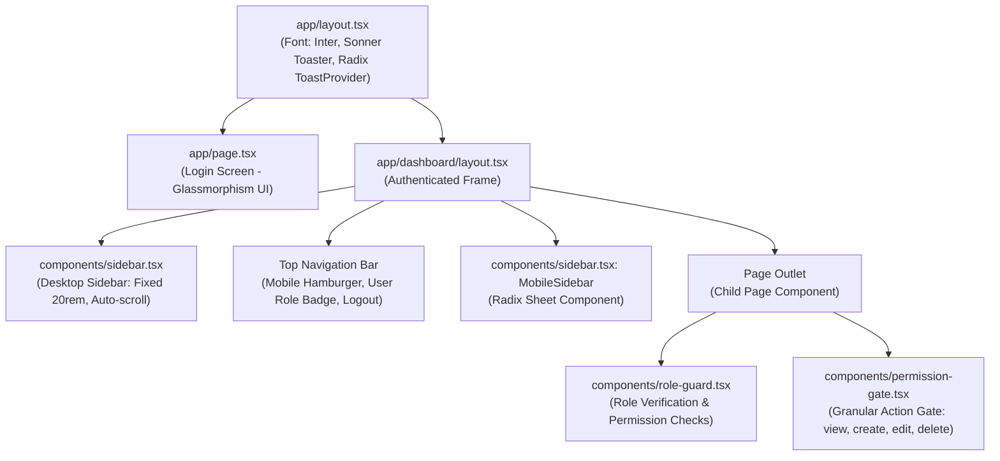
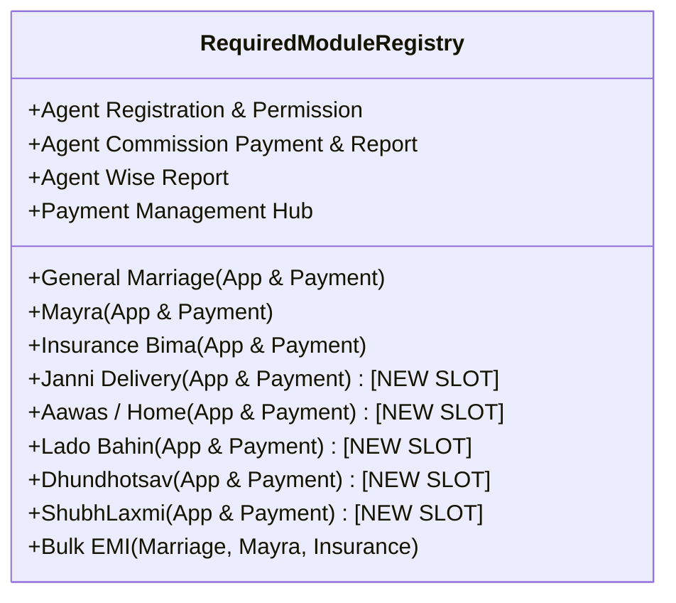
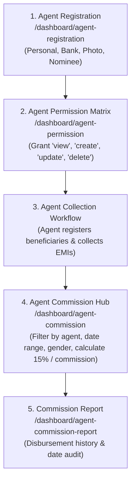
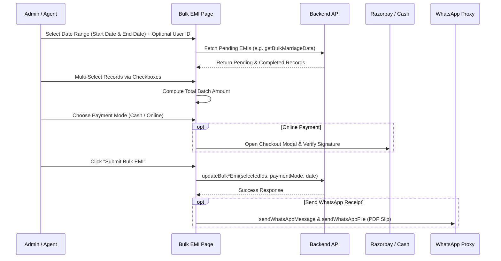
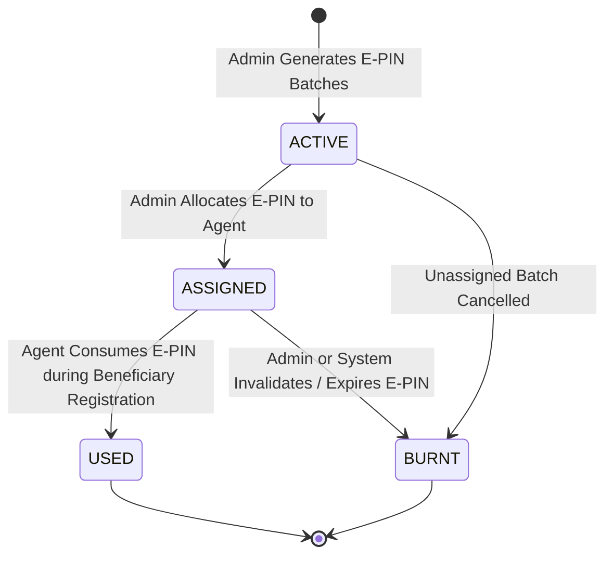
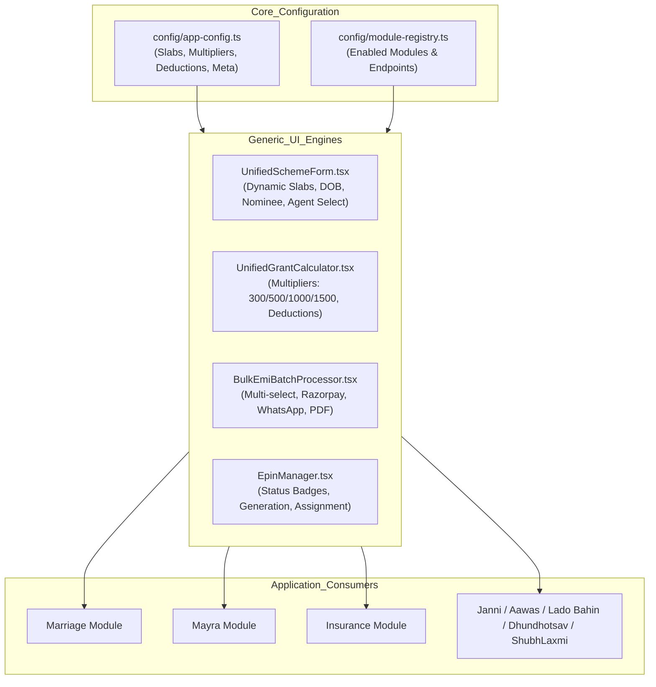
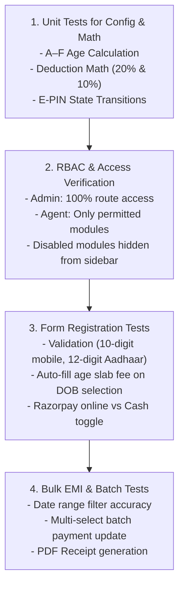

# SAF FOUNDATION – FRONTEND ARCHITECTURE AUDIT REPORT
**Phase 1: Read-Only Audit & Architectural Mapping**
**Target Application:** SAF Foundation (Admin & Agent Portal)
**Official Mobile Contact:** 9950730637
**Status:** COMPLETED (Read-Only / No Code or Backend Changes)

---

## EXECUTIVE SUMMARY

This audit provides a comprehensive structural, functional, and code-level evaluation of the existing frontend application for **SAF Foundation**. The application is an enterprise-grade administrative and agent portal constructed using **Next.js 14 (App Router)**, **React 18**, **TypeScript**, and **Tailwind CSS with Radix UI (shadcn/ui)**.

The current system manages beneficiary registrations, grant calculations, EMI collections, agent commissions, and PDF bond generation. However, the system currently contains significant **hardcoded domain constants** (such as legacy age slabs `21–55`, grant multipliers `100/200/300`, and hardcoded organization strings `Purabiya Prajapati`), **duplicated UI screens and API services**, and lacks a unified **Centralized Configuration & Module Registry** required for the standardized **SAF Foundation** domain rules (such as A–F Age Slabs: ₹1,500–₹11,000, Scheme Types: ₹300, ₹500, ₹1,000, ₹1,500, Gender Pools, Administrative Deductions, and E-PIN Lifecycle States).

---

## 1. FRONTEND STACK

| Layer / Technology | Component / Library | Version / Details | Purpose & Scope |
| :--- | :--- | :--- | :--- |
| **Framework** | Next.js | `14.2.16` (App Router) | Server & Client Components, API route handlers (`app/api/*`), Standalone output build |
| **Core UI Runtime** | React & React DOM | `^18.0.0` | Declarative UI rendering, hooks, memoized components |
| **Language** | TypeScript | `^5.0.0` | Strict type checking (`tsconfig.json`) |
| **Styling & Design** | Tailwind CSS + PostCSS | `^3.4.17` / `^8.5.0` | Utility-first CSS, custom design tokens, CSS variables (`globals.css`) |
| **Component Primitives** | Radix UI (`@radix-ui/*`) | Full Suite (`1.1.x` - `2.2.x`) | Accessible unstyled primitives (Dialog, Select, Tabs, Popover, Accordion, Checkbox, etc.) |
| **UI Component Kit** | shadcn/ui (`components/ui/*`) | Modular Tailwind components | Button, Card, Table, Sheet, Input, DatePicker, Toast, Badge |
| **Form & Validation** | React Hook Form & Zod | `^7.54.1` / `^3.24.0` | Form state management, schema validation (`@hookform/resolvers`) |
| **HTTP Client & Cache** | Axios & Custom Cache | `^1.12.2` | Request deduplication, JWT interceptors, TTL cache (`lib/api.ts`, `lib/api-cache.ts`) |
| **PDF Generation (BFF)** | PDF-Lib, PDFKit, Fontkit | `^1.17.1` / `^0.14.0` / `^2.0.4` | Server-side PDF generation in `app/api/generate-*-pdf` |
| **Client-Side PDF** | jsPDF, html2pdf.js | `^3.0.3` / `^0.10.1` | Client-side export and receipts (`lib/pdf-service.ts`) |
| **Payment Gateway** | Razorpay JS SDK | `^2.9.6` | Client checkout + Next.js BFF order creation (`app/api/razorpay/*`) |
| **Notifications** | Sonner & Radix Toast | `^1.7.4` / `1.2.4` | Toast alerts, error prompts |
| **Data Export** | SheetJS (`xlsx`) | `^0.18.5` | Excel report downloads from data tables |
| **Icons** | Lucide React | `^0.454.0` | Iconography throughout navigation and tables |

---

## 2. FOLDER STRUCTURE

```
purabiya-foundation-admin-main/
├── app/
│   ├── api/                          # Next.js BFF API Routes (30 handlers)
│   │   ├── fill-pdf-form/            # PDF field populator
│   │   ├── fireconnect/              # WhatsApp proxy
│   │   ├── generate-*-pdf/           # 20+ specialized PDF generation endpoints
│   │   ├── proxy-image/              # Image proxy for PDF embeds
│   │   ├── razorpay/                 # Razorpay order create & verify routes
│   │   └── whatsapp-test/            # Messaging integration test route
│   ├── dashboard/                    # Authenticated Next.js App Router Pages
│   │   ├── agent-commission/         # Agent Commission Payment screen
│   │   ├── agent-commission-report/  # Agent Commission & Payment Report
│   │   ├── agent-permission/         # Admin Agent Permission Matrix screen
│   │   ├── agent-registration/       # Agent list, add, and edit pages
│   │   ├── bulk-marriage-emi/        # Bulk Marriage EMI payment screen
│   │   ├── bulk-mayra-emi/           # Bulk Mayra EMI payment screen
│   │   ├── bulk-suraksha-bima-emi/   # Bulk Insurance EMI payment screen
│   │   ├── disability-cycle/         # [DISABLED CANDIDATE] Disability Cycle
│   │   ├── financal-help/            # [DISABLED CANDIDATE] Financial Help
│   │   ├── general-applications/     # General Marriage Applications (list, add, edit)
│   │   ├── general-applications-insurance/ # Insurance Bima Applications (list, add, edit)
│   │   ├── loan-application/         # [DISABLED CANDIDATE] Loan Applications
│   │   ├── marriage-congratulations/ # Marriage Congratulations + Sub-modules
│   │   │   ├── sewing-machine-distribution/ # [DISABLED CANDIDATE] Sewing Machine
│   │   │   └── mayra-registration/   # Nested Mayra congratulations
│   │   ├── mayra-congratulations/    # Mayra Congratulations Grant calculation
│   │   ├── mayra-registration/       # Mayra General Registration (list, add, edit, installments)
│   │   ├── payment-management/       # Centralized Payment Hub (Tabbed & Sub-routes)
│   │   │   ├── cash-flow/            # Cash flow ledger
│   │   │   ├── general-application-payment/
│   │   │   ├── insurance-application-payment/
│   │   │   ├── marriage-congratulations-payment/
│   │   │   ├── mayra-congratulations-payment/
│   │   │   ├── mayra-general-application-payment/
│   │   │   ├── suraksha-bima-yojana-payment/
│   │   │   ├── pension-yojana-payment/ # [DISABLED CANDIDATE]
│   │   │   └── loan-payment/         # [DISABLED CANDIDATE]
│   │   ├── pension-yojana/           # [DISABLED CANDIDATE] Pension Yojana
│   │   ├── sewing-machine/           # [DISABLED CANDIDATE] Sewing Machine Camp
│   │   ├── suraksha-bima-yojana/     # Insurance Bima Payment calculation
│   │   ├── layout.tsx                # Dashboard Layout with Sidebar & Header
│   │   └── page.tsx                  # Dashboard Overview Analytics & Summary
│   ├── layout.tsx                    # Root HTML/Body Layout with Providers
│   ├── loading.tsx                   # Top-level route transition loader
│   ├── globals.css                   # Global CSS & Tailwind layers
│   └── page.tsx                      # Root Authentication / Login Portal (Admin/Agent)
├── components/
│   ├── forms/                        # Form section and field abstractions
│   │   ├── application-form-sections.tsx # Personal, Contact, Nominee, Worker sections
│   │   ├── date-picker-field.tsx
│   │   ├── file-upload-field.tsx
│   │   ├── input-field.tsx
│   │   ├── select-field.tsx
│   │   └── optimized-insurance-form.tsx
│   ├── ui/                           # Radix/Tailwind Atomic Components (Button, Input, etc.)
│   ├── bulk-upload-button.tsx        # Excel bulk upload modal trigger
│   ├── data-table.tsx                # Primary DataTable with sorting, search, pagination
│   ├── display-table.tsx             # Read-only report table component
│   ├── optimized-data-table.tsx      # Performance-optimized virtualized table
│   ├── paginated-members-table.tsx   # Member installment sub-table
│   ├── paginated-table-section.tsx   # Pagination controls container
│   ├── permission-gate.tsx           # Component-level RBAC wrapper
│   ├── role-guard.tsx                # Route-level and UI-block RBAC wrapper
│   ├── razorpay-payment.tsx          # Razorpay checkout popover and modal integration
│   ├── sidebar.tsx                   # Main dynamic sidebar with RBAC filtering
│   └── theme-provider.tsx            # Theme provider
├── hooks/
│   ├── use-age-category.ts           # Age slab calculation hook
│   ├── use-crud.ts                   # Generic CRUD hook for standard endpoints
│   ├── use-form-data.ts              # Form state & validation reducer
│   ├── use-mobile.tsx                # Viewport responsive breakpoint hook
│   ├── use-permissions.ts            # RBAC access checking hook
│   ├── use-table-pagination.ts       # Table pagination state hook
│   └── use-toast.ts                  # Toast notification dispatcher
├── lib/
│   ├── api.ts                        # Axios client, deduplication, endpoint constants, API objects
│   ├── api-cache.ts                  # In-memory API TTL caching layer
│   ├── api-url.ts                    # Backend host configuration resolver
│   ├── fireconnect-whatsapp-service.ts # WhatsApp message & media sender
│   ├── form-values.ts                # Gender constants, payment modes, validators
│   ├── list-filters.ts               # In-memory list filter utilities
│   ├── logger.ts                     # Production-safe logging wrapper
│   ├── pagination.ts                 # Pagination math helper
│   ├── pdf-service.ts                # Client-side PDF generator
│   ├── permissions.ts                # Centralized permission definitions & role helpers
│   ├── services.ts                   # Strongly-typed API Service layer
│   ├── storage.ts                    # LocalStorage safe wrapper
│   ├── translations.ts               # Bilingual dictionary (Hindi / English)
│   ├── utils.ts                      # Date formatting, Indian currency formatting, image processors
│   └── whatsapp-service.ts           # Legacy WhatsApp service
└── types/                            # Global TypeScript ambient declarations
```

---

## 3. ROUTE MAP

| URL Route | File Path | Component / Page Name | Access Role | Description |
| :--- | :--- | :--- | :--- | :--- |
| `/` | `app/page.tsx` | `LoginPage` | Public | Dual-tab login portal (Admin & Agent authentication) |
| `/dashboard` | `app/dashboard/page.tsx` | `DashboardOverview` | Admin, Agent | Metric cards, monthly statistics, recent activity |
| `/dashboard/general-applications` | `app/dashboard/general-applications/page.tsx` | `GeneralApplicationsPage` | Admin, Agent | General Marriage Applications data table |
| `/dashboard/general-applications/add` | `app/dashboard/general-applications/add/page.tsx` | `AddGeneralApplicationPage` | Admin, Agent | Add General Marriage beneficiary registration |
| `/dashboard/general-applications/edit/[id]` | `app/dashboard/general-applications/edit/[id]/page.tsx` | `EditGeneralApplicationPage` | Admin, Agent | Edit General Marriage beneficiary record |
| `/dashboard/marriage-congratulations` | `app/dashboard/marriage-congratulations/page.tsx` | `MarriageCongratulationsPage` | Admin, Agent | Marriage Congratulation grant payments list |
| `/dashboard/marriage-congratulations/add` | `app/dashboard/marriage-congratulations/add/page.tsx` | `AddMarriageCongratulationPage` | Admin, Agent | Calculate & create marriage grant distribution |
| `/dashboard/marriage-congratulations/edit/[id]` | `app/dashboard/marriage-congratulations/edit/[id]/page.tsx` | `EditMarriageCongratulationPage` | Admin, Agent | Modify marriage congratulation grant record |
| `/dashboard/mayra-registration` | `app/dashboard/mayra-registration/page.tsx` | `MayraRegistrationPage` | Admin, Agent | Mayra General Applications registry table |
| `/dashboard/mayra-registration/add` | `app/dashboard/mayra-registration/add/page.tsx` | `AddMayraApplicationPage` | Admin, Agent | Add new Mayra beneficiary registration |
| `/dashboard/mayra-registration/edit/[id]` | `app/dashboard/mayra-registration/edit/[id]/page.tsx` | `EditMayraApplicationPage` | Admin, Agent | Edit Mayra beneficiary details |
| `/dashboard/mayra-registration/[id]/installments` | `app/dashboard/mayra-registration/[id]/installments/page.tsx` | `MayraInstallmentsPage` | Admin, Agent | View and collect individual member Mayra EMIs |
| `/dashboard/mayra-congratulations` | `app/dashboard/mayra-congratulations/page.tsx` | `MayraCongratulationsPage` | Admin, Agent | Mayra Congratulation grant payment table |
| `/dashboard/mayra-congratulations/add` | `app/dashboard/mayra-congratulations/add/page.tsx` | `AddMayraCongratulationPage` | Admin, Agent | Compute and record Mayra congratulation grant |
| `/dashboard/mayra-congratulations/edit/[id]` | `app/dashboard/mayra-congratulations/edit/[id]/page.tsx` | `EditMayraCongratulationPage` | Admin, Agent | Edit Mayra congratulation record |
| `/dashboard/mayra-congratulations/[id]/payments` | `app/dashboard/mayra-congratulations/[id]/payments/page.tsx` | `MayraCongratulationPaymentsPage` | Admin, Agent | View member contribution payment receipts |
| `/dashboard/general-applications-insurance` | `app/dashboard/general-applications-insurance/page.tsx` | `InsuranceApplicationsPage` | Admin, Agent | Insurance Bima General Application records |
| `/dashboard/general-applications-insurance/add` | `app/dashboard/general-applications-insurance/add/page.tsx` | `AddInsuranceApplicationPage` | Admin, Agent | Add new Insurance Bima beneficiary |
| `/dashboard/general-applications-insurance/edit/[id]` | `app/dashboard/general-applications-insurance/edit/[id]/page.tsx` | `EditInsuranceApplicationPage` | Admin, Agent | Edit Insurance Bima beneficiary record |
| `/dashboard/suraksha-bima-yojana` | `app/dashboard/suraksha-bima-yojana/page.tsx` | `SurakshaBimaYojanaPage` | Admin, Agent | Insurance Bima Payment grant calculations |
| `/dashboard/suraksha-bima-yojana/add` | `app/dashboard/suraksha-bima-yojana/add/page.tsx` | `AddSurakshaBimaPage` | Admin, Agent | Generate Insurance claim payment & deduction |
| `/dashboard/suraksha-bima-yojana/edit/[id]` | `app/dashboard/suraksha-bima-yojana/edit/[id]/page.tsx` | `EditSurakshaBimaPage` | Admin, Agent | Edit Insurance claim payment record |
| `/dashboard/agent-registration` | `app/dashboard/agent-registration/page.tsx` | `AgentRegistrationPage` | Admin Only | Field Agent master list and credentials |
| `/dashboard/agent-registration/add` | `app/dashboard/agent-registration/add/page.tsx` | `AddAgentPage` | Admin Only | Register new field agent/worker |
| `/dashboard/agent-registration/edit/[id]` | `app/dashboard/agent-registration/edit/[id]/page.tsx` | `EditAgentPage` | Admin Only | Update agent profile and banking data |
| `/dashboard/agent-permission` | `app/dashboard/agent-permission/page.tsx` | `AgentPermissionPage` | Admin Only | Module and action RBAC permission matrix for agents |
| `/dashboard/agent-commission` | `app/dashboard/agent-commission/page.tsx` | `AgentCommissionPage` | Admin Only | Calculate & disburse agent collection commissions |
| `/dashboard/agent-commission-report` | `app/dashboard/agent-commission-report/page.tsx` | `AgentCommissionReportPage` | Admin Only | Historical commission disbursement report |
| `/dashboard/bulk-marriage-emi` | `app/dashboard/bulk-marriage-emi/page.tsx` | `BulkMarriageEMIPage` | Admin, Agent | Batch collection and receipt generation for Marriage EMIs |
| `/dashboard/bulk-mayra-emi` | `app/dashboard/bulk-mayra-emi/page.tsx` | `BulkMayraEMIPage` | Admin, Agent | Batch collection and receipt generation for Mayra EMIs |
| `/dashboard/bulk-suraksha-bima-emi` | `app/dashboard/bulk-suraksha-bima-emi/page.tsx` | `BulkSurakshaBimaEMIPage` | Admin, Agent | Batch collection for Insurance Bima EMIs |
| `/dashboard/payment-management` | `app/dashboard/payment-management/page.tsx` | `PaymentManagementPage` | Admin, Agent | Central Tabbed Payment Management Hub |
| `/dashboard/payment-management/cash-flow` | `app/dashboard/payment-management/cash-flow/page.tsx` | `CashFlowPage` | Admin Only | Daily cash inflow/outflow audit ledger |
| `/dashboard/payment-management/general-application-payment` | `.../general-application-payment/page.tsx` | `GeneralApplicationPaymentListPage` | Admin, Agent | Marriage registration initial fee payments |
| `/dashboard/payment-management/general-application-payment/[userId]` | `.../general-application-payment/[userId]/page.tsx` | `GeneralApplicationUserPaymentPage` | Admin, Agent | Single beneficiary Marriage payment history & receipt |
| `/dashboard/payment-management/marriage-congratulations-payment` | `.../marriage-congratulations-payment/page.tsx` | `MarriageCongratulationsPaymentListPage` | Admin, Agent | Marriage congratulations payment list |
| `/dashboard/payment-management/marriage-congratulations-payment/[userId]` | `.../marriage-congratulations-payment/[userId]/page.tsx` | `MarriageCongratulationsUserPaymentPage` | Admin, Agent | Individual member Marriage grant ledger |
| `/dashboard/payment-management/mayra-general-application-payment` | `.../mayra-general-application-payment/page.tsx` | `MayraGeneralApplicationPaymentListPage` | Admin, Agent | Mayra registration initial fee payments |
| `/dashboard/payment-management/mayra-general-application-payment/[userId]` | `.../mayra-general-application-payment/[userId]/page.tsx` | `MayraGeneralApplicationUserPaymentPage` | Admin, Agent | Mayra beneficiary payment ledger |
| `/dashboard/payment-management/mayra-congratulations-payment` | `.../mayra-congratulations-payment/page.tsx` | `MayraCongratulationsPaymentListPage` | Admin, Agent | Mayra congratulations payment table |
| `/dashboard/payment-management/mayra-congratulations-payment/[userId]` | `.../mayra-congratulations-payment/[userId]/page.tsx` | `MayraCongratulationsUserPaymentPage` | Admin, Agent | Individual Mayra member grant breakdown |
| `/dashboard/payment-management/insurance-application-payment` | `.../insurance-application-payment/page.tsx` | `InsuranceApplicationPaymentListPage` | Admin, Agent | Insurance registration fee ledger |
| `/dashboard/payment-management/insurance-application-payment/[userId]` | `.../insurance-application-payment/[userId]/page.tsx` | `InsuranceApplicationUserPaymentPage` | Admin, Agent | Insurance beneficiary payment ledger |
| `/dashboard/payment-management/suraksha-bima-yojana-payment` | `.../suraksha-bima-yojana-payment/page.tsx` | `SurakshaBimaYojanaPaymentListPage` | Admin, Agent | Insurance claim payment tracker |
| `/dashboard/payment-management/suraksha-bima-yojana-payment/[userId]` | `.../suraksha-bima-yojana-payment/[userId]/page.tsx` | `SurakshaBimaYojanaUserPaymentPage` | Admin, Agent | Single Insurance grant payment details |
| `/dashboard/disability-cycle` | `app/dashboard/disability-cycle/page.tsx` | `DisabilityCyclePage` | Admin | *[DISABLED CANDIDATE]* Disability Cycle table |
| `/dashboard/sewing-machine` | `app/dashboard/sewing-machine/page.tsx` | `SewingMachinePage` | Admin | *[DISABLED CANDIDATE]* Sewing Machine Camp |
| `/dashboard/pension-yojana` | `app/dashboard/pension-yojana/page.tsx` | `PensionYojanaPage` | Admin | *[DISABLED CANDIDATE]* Pension Yojana |
| `/dashboard/loan-application` | `app/dashboard/loan-application/page.tsx` | `LoanApplicationPage` | Admin | *[DISABLED CANDIDATE]* Balika Loan list |
| `/dashboard/financal-help` | `app/dashboard/financal-help/page.tsx` | `FinancialHelpPage` | Admin | *[DISABLED CANDIDATE]* Financial Help list |

---

## 4. LAYOUT MAP



### Layout Architecture Specifications:
1. **Root Layout (`app/layout.tsx`)**:
   - Injects global stylesheet `globals.css`
   - Configures HTML metadata: `title: "Foundation Admin Panel"`, `description: "Purbiya Prajapati Balika Vivah & SaShaktikaran Foundation Admin Panel"` *(Hardcoded string to be centralized)*
   - Integrates `<Toaster position="top-right" richColors closeButton />` and `<ToastProvider>`
2. **Dashboard Layout (`app/dashboard/layout.tsx`)**:
   - Implements authentication validation on mount: checks `localStorage.getItem("isAuthenticated")` and redirects to `/` if false
   - Renders a 2-column responsive layout: Fixed 20rem desktop sidebar (`--sidebar-width: 20rem`) and fluid main content area
   - Renders dynamic top bar with bilingual user badge (`formatBilingual("roles.foundationAdmin")` / `formatBilingual("roles.foundationAgent")`)

---

## 5. SIDEBAR & NAVIGATION MAP

The sidebar is defined in `components/sidebar.tsx`. Below is the complete mapping of sidebar entries, their associated modules, target routes, and access levels:

| Menu Title (Hindi / English) | Subtitle | Target Route (`href`) | Module Code | Permission Key | Admin | Agent Default |
| :--- | :--- | :--- | :--- | :--- | :---: | :---: |
| **Dashboard** | Dashboard | `/dashboard` | `dashboard` | `dashboard:view` | Yes | Yes |
| **सामान्य आवेदन** | General Marriage Application | `/dashboard/general-applications` | `applicant_registration` | `applicant_registration:view` | Yes | Yes |
| **विवाह फॉर्म आवेदन पत्र** | General Marriage Congratulations Payment | `/dashboard/marriage-congratulations` | `marriage_congratulations` | `marriage_congratulations:view` | Yes | No* |
| ↳ *विवाह सिलाई मशीन वितरण* | *Marriage Sewing Machine Distribution* | `/dashboard/marriage-congratulations/sewing-machine-distribution` | `marriage_sewing_machine_distribution` | `marriage_sewing_machine_distribution:view` | Yes | No* |
| **मायरा फॉर्म आवेदन पत्र** | Mayra General Application | `/dashboard/mayra-registration` | `mayra_registration` | `mayra_registration:view` | Yes | Yes |
| ↳ *मायरा बधाई पत्र* | *Mayra Congratulations Payment* | `/dashboard/mayra-congratulations` | `mayra_registration` | `mayra_registration:view` | Yes | Yes |
| **सुरक्षा बीमा हेतु सामान्य आवेदन** | Insurance Bima Application | `/dashboard/general-applications-insurance` | `security_application` | `security_application:view` | Yes | Yes |
| ↳ *सुरक्षा बीमा योजना* | *Insurance Bima Payment* | `/dashboard/suraksha-bima-yojana` | `suraksha_bima_yojana` | `suraksha_bima_yojana:view` | Yes | No* |
| **निशुल्क साइकिल वितरण** | Disability Cycle Distribution | `/dashboard/disability-cycle` | `disability_cycle_distribution` | `disability_cycle_distribution:view` | Yes | No |
| **निशुल्क सिलाई मशीन शिविर** | Sewing Machine Camp | `/dashboard/sewing-machine` | `sewing_machine_camp` | `sewing_machine_camp:view` | Yes | No |
| **सहलाकर पेंशन योजना** | Pension Yojana Application Payment | `/dashboard/pension-yojana` | `salakar_pension_yojana` | `salakar_pension_yojana:view` | Yes | No |
| **बालिका ऋण आवेदन फॉर्म** | Balika loan Application | `/dashboard/loan-application` | `balika_loan_application` | `balika_loan_application:view` | Yes | No |
| **वित्त सहायता आवेदन** | Financial Application Payment | `/dashboard/financal-help` | `financial_help` | `financial_help:view` | Yes | No |
| **एजेंट आवेदन** | Agent Registration | `/dashboard/agent-registration` | `agent_registration` | `agent_registration:view` | Yes | No |
| ↳ *एजेंट की अनुमति* | *Agent Permission* | `/dashboard/agent-permission` | `agent_permission` | Admin Only (`isAdmin()`) | Yes | No |
| **एजेंट कमिशन का भुगतान करे** | Agents Commission Payment | `/dashboard/agent-commission` | `agent_commission` | `agent_commission:view` | Yes | No |
| **एजेंट कमिशन रिपोर्ट** | Agent Commission Report | `/dashboard/agent-commission-report` | `agent_commission_report` | `agent_commission_report:view` | Yes | No |
| **बल्क विवाह ईएमआई** | Bulk Marriage EMI | `/dashboard/bulk-marriage-emi` | `bulk_marriage_emi` | `bulk_marriage_emi:view` | Yes | Yes |
| **बल्क सुरक्षा बीमा ईएमआई** | Bulk Suraksha Bima EMI | `/dashboard/bulk-suraksha-bima-emi` | `bulk_suraksha_bima_emi` | `bulk_suraksha_bima_emi:view` | Yes | Yes |
| **बल्क मायरा ईएमआई** | Bulk Mayra EMI | `/dashboard/bulk-mayra-emi` | `bulk_mayra_emi` | `bulk_mayra_emi:view` | Yes | Yes |
| **भुगतान प्रबंधन** | Payment Management | `/dashboard/payment-management` | `payment_management` | `payment_management:view` | Yes | Yes |

*\*Note: Some sub-modules are assigned distinct module keys in sidebar (`marriage_congratulations`, `suraksha_bima_yojana`) vs `permissions.ts` (`marriage_congratulations_payment`, `suraksha_bima_yojana_payment`), causing permission discrepancies.*

---

## 6. PERMISSION & RBAC MAP

The RBAC system is implemented across three core files:
1. `lib/permissions.ts` (Core logic, role checkers, module mapping)
2. `components/role-guard.tsx` (Component & route wrapper)
3. `components/permission-gate.tsx` (Fine-grained action wrapper)

```mermaid
flowchart TD
    UserLogin["User Logs In<br/>(Admin or Agent)"] --> SessionSaved["Save to LocalStorage<br/>- token<br/>- userRole ('admin' | 'agent')<br/>- agent (with permissions object)"]
    SessionSaved --> NavCheck{"Route/Menu Check"}
    
    NavCheck -->|Role is Admin| AdminFullAccess["Full Access<br/>All 13 Modules<br/>All Actions (view, create, update, delete)"]
    
    NavCheck -->|Role is Agent| FilterPermissions["Filter against AGENT_ALLOWED_MODULES<br/>in lib/permissions.ts"]
    
    FilterPermissions --> AllowedAgentModules["Agent Authorized Modules:<br/>1. dashboard<br/>2. applicant_registration<br/>3. security_application<br/>4. payment_management<br/>5. general_application_payment<br/>6. insurance_application_payment<br/>7. marriage_congratulations_payment<br/>8. suraksha_bima_yojana_payment<br/>9. bulk_marriage_emi<br/>10. bulk_suraksha_bima_emi<br/>11. mayra_registration<br/>12. bulk_mayra_emi"]
    
    AllowedAgentModules --> PermissionGateCheck{"PermissionGate Action Check"}
    PermissionGateCheck -->|Has action ('view'/'create')| RenderComponent["Render UI Block / Page"]
    PermissionGateCheck -->|Missing action| HideOrFallback["Render Null / Access Denied Alert"]
```

### RBAC Inconsistencies Discovered:
- **Module Key Desynchronization:** `lib/permissions.ts` defines `AVAILABLE_MODULES` with `12` modules, while `components/sidebar.tsx` references `19` different module string names (e.g., `salakar_pension_yojana`, `financial_help`, `disability_cycle_distribution`).
- **Tab vs Route Module Divergence:** In Payment Management (`/dashboard/payment-management`), the tabs use `general_application_payment`, `marriage_congratulations_payment`, and `suraksha_bima_yojana_payment`, while sidebar links directly to `/dashboard/marriage-congratulations` using `marriage_congratulations`.
- **Client-Side Only Authorization:** User roles and permissions are read from `localStorage` without JWT payload signature re-validation on each client-side route transition.

---

## 7. COMPLETE MODULE MAP

Below is the exhaustive matrix of all functional frontend modules:

| Module Identifier | Hindi Name | English / Purpose | Status in Audit | Routes Included | Associated APIs |
| :--- | :--- | :--- | :---: | :--- | :--- |
| `applicant_registration` | सामान्य आवेदन | General Marriage Application | **Active (Required)** | `/dashboard/general-applications/*` | `getApplications`, `addApplication`, `updateApplication`, `deleteApplication` |
| `marriage_congratulations` | विवाह फॉर्म आवेदन पत्र | Marriage Congratulation Payment | **Active (Required)** | `/dashboard/marriage-congratulations/*` | `getMarriageCongratulations`, `createMarriageCongratulations`, `getMarriageCongratulationsDetails` |
| `mayra_registration` | मायरा फॉर्म आवेदन पत्र | Mayra General Application | **Active (Required)** | `/dashboard/mayra-registration/*` | `getMayraApplications`, `createMayraApplication`, `updateMayraApplication`, `deleteMayraApplication` |
| `mayra_congratulations` | मायरा बधाई पत्र | Mayra Congratulation Payment | **Active (Required)** | `/dashboard/mayra-congratulations/*` | `getMayraCongratulations`, `createMayraCongratulations`, `getMayraCongratulationsDetails` |
| `security_application` | सुरक्षा बीमा आवेदन | Insurance Bima Application | **Active (Required)** | `/dashboard/general-applications-insurance/*` | `getInsurances`, `createInsurance`, `updateInsurance`, `deleteInsurance` |
| `suraksha_bima_yojana` | सुरक्षा बीमा योजना | Insurance Bima Payment | **Active (Required)** | `/dashboard/suraksha-bima-yojana/*` | `getSurakshaBimaYojanas`, `createSurakshaBimaYojana`, `updateSurakshaBimaYojana` |
| `agent_registration` | एजेंट आवेदन | Agent Registration | **Active (Required)** | `/dashboard/agent-registration/*` | `getAgents`, `createAgent`, `updateAgent`, `deleteAgent` |
| `agent_permission` | एजेंट की अनुमति | Agent Permission Matrix | **Active (Required)** | `/dashboard/agent-permission` | `getAgents`, `getAgentPermissions`, `updateAgentPermissions` |
| `agent_commission` | एजेंट कमिशन भुगतान | Agent Commission Payment | **Active (Required)** | `/dashboard/agent-commission` | `getBulkDataByAddedBy`, `getAgents`, `payAgentCommission` |
| `agent_commission_report`| एजेंट कमिशन रिपोर्ट | Agent Commission Report | **Active (Required)** | `/dashboard/agent-commission-report`| `getAgents`, `getAgentPaymentDetails` |
| `bulk_marriage_emi` | बल्क विवाह ईएमआई | Bulk Marriage EMI | **Active (Required)** | `/dashboard/bulk-marriage-emi` | `getBulkMarriageData`, `updateBulkMarriageEmi` |
| `bulk_mayra_emi` | बल्क मायरा ईएमआई | Bulk Mayra EMI | **Active (Required)** | `/dashboard/bulk-mayra-emi` | `getBulkMayraData`, `updateBulkMayraEmi` |
| `bulk_suraksha_bima_emi` | बल्क बीमा ईएमआई | Bulk Insurance Bima EMI | **Active (Required)** | `/dashboard/bulk-suraksha-bima-emi` | `getBulkSurakshaBimaData`, `updateBulkSurakshaBimaEmi` |
| `payment_management` | भुगतान प्रबंधन | Central Payment Hub | **Active (Required)** | `/dashboard/payment-management/*` | All entity installment & payment APIs |
| `marriage_sewing_machine` | विवाह सिलाई मशीन | Sewing Machine Distribution | **Disabled Candidate** | `/dashboard/marriage-congratulations/sewing-machine-distribution` | `getMarriageSewingMachines`, `createMarriageSewingMachine` |
| `sewing_machine_camp` | सिलाई मशीन शिविर | Sewing Machine Camp | **Disabled Candidate** | `/dashboard/sewing-machine/*` | `getSewingMachineCamps`, `createSewingMachineCamp` |
| `disability_cycle` | दिव्यांग साइकिल | Disability Cycle Distribution | **Disabled Candidate** | `/dashboard/disability-cycle/*` | `getDisabilityCycles`, `createDisabilityCycle` |
| `salakar_pension_yojana`| पेंशन योजना | Pension Yojana Payment | **Disabled Candidate** | `/dashboard/pension-yojana/*` | `getPensionYojanas`, `createPensionYojana` |
| `balika_loan_application`| बालिका ऋण आवेदन | Loan Application List | **Disabled Candidate** | `/dashboard/loan-application/*` | `getLoanApplications`, `createLoanApplication` |
| `financial_help` | वित्त सहायता आवेदन | Financial Help Payment | **Disabled Candidate** | `/dashboard/financal-help/*` | `getFinancialHelps`, `createFinancialHelp` |

---

## 8. REQUIRED MODULE MAPPING

Mapping the **16 Required Modules** against existing codebase architecture:



| Required Module | Existing Route | Existing Page Component | Backend API Calls (`lib/api.ts`) | Sidebar Entry | Reusable Components Utilized |
| :--- | :--- | :--- | :--- | :--- | :--- |
| **1. General Marriage Application**<br>↳ *General Marriage Congratulation Payment* | `/dashboard/general-applications`<br>`/dashboard/marriage-congratulations` | `GeneralApplicationsPage`<br>`MarriageCongratulationsPage` | `getApplications`, `addApplication`<br>`getMarriageCongratulations`, `createMarriageCongrats` | `सामान्य आवेदन`<br>`विवाह फॉर्म आवेदन पत्र` | `DataTable`, `RoleGuard`, `RazorpayPayment`, `DatePickerField`, `ApplicationFormSections` |
| **2. Mayra General Application**<br>↳ *Mayra Marriage Congratulation Payment* | `/dashboard/mayra-registration`<br>`/dashboard/mayra-congratulations` | `MayraRegistrationPage`<br>`MayraCongratulationsPage` | `getMayraApplications`<br>`getMayraCongratulations`, `createMayraCongratulations` | `मायरा फॉर्म आवेदन पत्र`<br>`मायरा बधाई पत्र` | `DataTable`, `RoleGuard`, `RazorpayPayment`, `DatePickerField` |
| **3. Insurance Bima Application**<br>↳ *Insurance Bima Payment* | `/dashboard/general-applications-insurance`<br>`/dashboard/suraksha-bima-yojana` | `InsuranceApplicationsPage`<br>`SurakshaBimaYojanaPage` | `getInsurances`, `createInsurance`<br>`getSurakshaBimaYojanas`, `createSurakshaBimaYojana` | `सुरक्षा बीमा हेतु सामान्य आवेदन`<br>`सुरक्षा बीमा योजना` | `OptimizedInsuranceForm`, `DataTable`, `RoleGuard`, `RazorpayPayment` |
| **4. Janni Delivery Application**<br>↳ *Janni Delivery Congratulation Payment* | *To be registered via Unified Registry* | *Mapped to Generic Scheme Engine* | *Standard Scheme API Pattern (`getSchemeApplications`)* | *Configurable Menu* | `UnifiedSchemeForm`, `UnifiedCongratulationForm`, `DataTable` |
| **5. Aawas (Home) Application**<br>↳ *Aawas Congratulation Payment* | *To be registered via Unified Registry* | *Mapped to Generic Scheme Engine* | *Standard Scheme API Pattern* | *Configurable Menu* | `UnifiedSchemeForm`, `UnifiedCongratulationForm`, `DataTable` |
| **6. Lado Bahin Application**<br>↳ *Lado Bahin Congratulation Payment* | *To be registered via Unified Registry* | *Mapped to Generic Scheme Engine* | *Standard Scheme API Pattern* | *Configurable Menu* | `UnifiedSchemeForm`, `UnifiedCongratulationForm`, `DataTable` |
| **7. Dhundhotsav Application**<br>↳ *Dhundhotsav Congratulation Payment* | *To be registered via Unified Registry* | *Mapped to Generic Scheme Engine* | *Standard Scheme API Pattern* | *Configurable Menu* | `UnifiedSchemeForm`, `UnifiedCongratulationForm`, `DataTable` |
| **8. ShubhLaxmi Application**<br>↳ *ShubhLaxmi Congratulation Payment* | *To be registered via Unified Registry* | *Mapped to Generic Scheme Engine* | *Standard Scheme API Pattern* | *Configurable Menu* | `UnifiedSchemeForm`, `UnifiedCongratulationForm`, `DataTable` |
| **9. Agent Registration**<br>↳ *Agent Permission* | `/dashboard/agent-registration`<br>`/dashboard/agent-permission` | `AgentRegistrationPage`<br>`AgentPermissionPage` | `getAgents`, `createAgent`<br>`getAgentPermissions`, `updateAgentPermissions` | `एजेंट आवेदन`<br>`एजेंट की अनुमति` | `DataTable`, `RoleGuard`, `Card`, `Checkbox`, `Select` |
| **10. Agent Commission Payment** | `/dashboard/agent-commission` | `BulkDataReportPage` | `getBulkDataByAddedBy`, `getAgents`, `payAgentCommission` | `एजेंट कमिशन का भुगतान करे` | `DisplayTable`, `Tabs`, `DatePicker`, `Select` |
| **11. Agent Commission Report** | `/dashboard/agent-commission-report` | `AgentCommissionReportPage` | `getAgents`, `getAgentPaymentDetails` | `एजेंट कमिशन रिपोर्ट` | `DisplayTable`, `Select`, `Card` |
| **12. Agent Wise Report** | `/dashboard/agent-commission` (Tab 2/Filter) | `BulkDataReportPage` | `getBulkDataByAddedBy` | Integrated with Commission | `DisplayTable`, `DatePicker` |
| **13. Bulk Marriage EMI** | `/dashboard/bulk-marriage-emi` | `BulkMarriageEMIPage` | `getBulkMarriageData`, `updateBulkMarriageEmi` | `बल्क विवाह ईएमआई` | `DataTable`, `RazorpayPayment`, `Checkbox`, `DatePicker` |
| **14. Bulk Mayra EMI** | `/dashboard/bulk-mayra-emi` | `BulkMayraEMIPage` | `getBulkMayraData`, `updateBulkMayraEmi` | `बल्क मायरा ईएमआई` | `DataTable`, `RazorpayPayment`, `Checkbox`, `DatePicker` |
| **15. Bulk Insurance Bima EMI** | `/dashboard/bulk-suraksha-bima-emi` | `BulkSurakshaBimaEMIPage` | `getBulkSurakshaBimaData`, `updateBulkSurakshaBimaEmi` | `बल्क सुरक्षा बीमा ईएमआई` | `DataTable`, `RazorpayPayment`, `Checkbox`, `DatePicker` |
| **16. Payment Management** | `/dashboard/payment-management` | `PaymentManagementPage` | All module payment sub-APIs | `भुगतान प्रबंधन` | `Tabs`, `PermissionGate`, Sub-table pages |

---

## 9. DISABLED MODULE MAPPING

These modules must **NOT be deleted**. In Phase 2, they will be toggled off via the Centralized Module Feature Flags (`enabled: false`):

| Disabled Module Candidate | Current Route | File Locations | Current Status | Decommissioning Strategy |
| :--- | :--- | :--- | :--- | :--- |
| **Marriage Sewing Machine Distribution** | `/dashboard/marriage-congratulations/sewing-machine-distribution` | `app/dashboard/marriage-congratulations/sewing-machine-distribution/*` | Active in sidebar under Marriage Congratulations | Set `enabled: false` in Module Registry; hide from sidebar and router guard |
| **Sewing Machine Camp** | `/dashboard/sewing-machine` | `app/dashboard/sewing-machine/*` | Active standalone menu in sidebar | Set `enabled: false` in Module Registry; retain files for legacy records |
| **Disability Cycle Distribution** | `/dashboard/disability-cycle` | `app/dashboard/disability-cycle/*` | Active standalone menu in sidebar | Set `enabled: false` in Module Registry; preserve historical data viewing |
| **Pension Yojana Application Payment** | `/dashboard/pension-yojana` | `app/dashboard/pension-yojana/*`<br>`app/dashboard/payment-management/pension-yojana-payment/*` | Active standalone menu & payment tab | Set `enabled: false`; disable tab in Payment Management hub |
| **Loan Application List** | `/dashboard/loan-application` | `app/dashboard/loan-application/*`<br>`app/dashboard/payment-management/loan-payment/*` | Active standalone menu & payment tab | Set `enabled: false`; disable tab in Payment Management hub |
| **Financial Help** | `/dashboard/financal-help` | `app/dashboard/financal-help/*`<br>`app/dashboard/payment-management/finance-help-payment/*` | Active in sidebar | Set `enabled: false`; preserve file templates |

---

## 10. API INTEGRATION MAP

The frontend communicates with the backend via two layers:
1. **PHP/REST Backend Service** via `lib/api.ts` and `lib/services.ts`
2. **Next.js Backend-for-Frontend (BFF)** via `app/api/*`

```mermaid
flowchart LR
    FrontendPages["Frontend Pages / Components"]
    
    subgraph NextJS_BFF["Next.js BFF (app/api/*)"]
        PDFGen["PDF Generators (20 endpoints)<br/>/api/generate-*-pdf"]
        RazorpayProxy["Razorpay Gateway<br/>/api/razorpay/*"]
        WhatsAppProxy["WhatsApp Messenger<br/>/api/fireconnect"]
    end
    
    subgraph PHP_Backend["Primary Backend API (REST/PHP)"]
        AuthAPIs["Auth: login, agentLogin"]
        AppAPIs["Applications: getApplications, addApplication..."]
        CongratsAPIs["Grants: getMarriageCongratulationsDetails..."]
        BulkEMIAPIs["Bulk EMI: getBulkMarriageData, updateBulk..."]
        AgentAPIs["Agents: getAgents, getAgentPermissions..."]
    end
    
    FrontendPages -->|Direct Axios Call| PHP_Backend
    FrontendPages -->|Fetch Request| NextJS_BFF
    NextJS_BFF -->|Proxy Data / Webhooks| PHP_Backend
```



### Complete API Integration Table:

| API Function (`lib/api.ts`) | Endpoint (`?apicall=...`) | HTTP Method | Consuming Frontend Pages |
| :--- | :--- | :---: | :--- |
| `authAPI.login` | `?apicall=login` | POST | `app/page.tsx` (Admin Login) |
| `authAPI.agentLogin` | `?apicall=agentLogin` | POST | `app/page.tsx` (Agent Login) |
| `dashboardAPI.getDashboardData` | `?apicall=getDashboardData` | POST | `app/dashboard/page.tsx` |
| `generalApplicationsAPI.getAll` | `?apicall=getApplications` | POST | `app/dashboard/general-applications/page.tsx` |
| `generalApplicationsAPI.create` | `?apicall=addApplication` | POST (FormData) | `app/dashboard/general-applications/add/page.tsx` |
| `generalApplicationsAPI.update` | `?apicall=updateApplication` | POST (FormData) | `app/dashboard/general-applications/edit/[id]/page.tsx` |
| `generalApplicationsAPI.delete` | `?apicall=deleteApplication` | POST (FormData) | `app/dashboard/general-applications/page.tsx` |
| `marriageCongratulationsAPI.getAll` | `?apicall=getMarriageCongratulations` | POST | `app/dashboard/marriage-congratulations/page.tsx` |
| `marriageCongratulationsAPI.create` | `?apicall=createMarriageCongratulations` | POST (FormData) | `app/dashboard/marriage-congratulations/add/page.tsx` |
| `marriageCongratulationsLookupAPI.getDetails`| `?apicall=getMarriageCongratulationsDetails`| POST | `app/dashboard/marriage-congratulations/add/page.tsx` |
| `mayraApplicationAPI.getAll` | `?apicall=getMayraApplications` | POST | `app/dashboard/mayra-registration/page.tsx` |
| `mayraApplicationAPI.create` | `?apicall=createMayraApplication` | POST (FormData) | `app/dashboard/mayra-registration/add/page.tsx` |
| `mayraCongratsAPI.getDetails` | `?apicall=getMayraCongratulationsDetails`| POST (UrlEncoded)| `app/dashboard/mayra-congratulations/add/page.tsx` |
| `insuranceApplicationsAPI.getAll` | `?apicall=getInsurances` | POST | `app/dashboard/general-applications-insurance/page.tsx` |
| `insuranceApplicationsAPI.create` | `?apicall=createInsurance` | POST (FormData) | `components/forms/optimized-insurance-form.tsx` |
| `surakshaBimaYojanaAPI.getAll` | `?apicall=getSurakshaBimaYojanas` | POST | `app/dashboard/suraksha-bima-yojana/page.tsx` |
| `surakshaBimaYojanaAPI.create` | `?apicall=createSurakshaBimaYojana`| POST (FormData) | `app/dashboard/suraksha-bima-yojana/add/page.tsx` |
| `agentRegistrationAPI.getAll` | `?apicall=getAgents` | POST/GET | `app/dashboard/agent-registration/page.tsx` |
| `agentPermissionAPI.getPermissions` | `?apicall=getAgentPermissions` | POST (UrlEncoded)| `app/dashboard/agent-permission/page.tsx` |
| `agentPermissionAPI.updatePermissions` | `?apicall=updateAgentPermissions` | POST (UrlEncoded)| `app/dashboard/agent-permission/page.tsx` |
| `agentCommissionBulkAPI.getDataByAddedBy` | `?apicall=getBulkDataByAddedBy` | POST (FormData) | `app/dashboard/agent-commission/page.tsx` |
| `marriageBulkAPI.getData` | `?apicall=getBulkMarriageData` | POST (FormData) | `app/dashboard/bulk-marriage-emi/page.tsx` |
| `marriageBulkAPI.updateEmi` | `?apicall=updateBulkMarriageEmi` | POST (FormData) | `app/dashboard/bulk-marriage-emi/page.tsx` |
| `mayraBulkAPI.getData` | `?apicall=getBulkMayraData` | POST (FormData) | `app/dashboard/bulk-mayra-emi/page.tsx` |
| `mayraBulkAPI.updateEmi` | `?apicall=updateBulkMayraEmi` | POST (FormData) | `app/dashboard/bulk-mayra-emi/page.tsx` |
| `surakshaBimaBulkAPI.getData` | `?apicall=getBulkSurakshaBimaData`| POST (FormData) | `app/dashboard/bulk-suraksha-bima-emi/page.tsx` |
| `surakshaBimaBulkAPI.updateEmi` | `?apicall=updateBulkSurakshaBimaEmi`| POST (FormData) | `app/dashboard/bulk-suraksha-bima-emi/page.tsx` |

---

## 11. PAYMENT UI MAP

Payment handling is distributed across registration pages, grant calculation pages, bulk EMI collectors, and the dedicated Payment Management tabbed hub:

### Identified Payment UI Implementations:
1. **Upfront Registration Fees:**
   - Handled inside `add/page.tsx` of `general-applications`, `general-applications-insurance`, `mayra-registration`.
   - Supports dual modes: `Cash` and `Razorpay (Online)`.
   - Integrates `<RazorpayPayment />` trigger modal.
2. **Grant Disbursement & Administrative Deduction UI:**
   - In `marriage-congratulations/add`, `mayra-congratulations/add`, and `suraksha-bima-yojana/add`.
   - Displays gross member contribution, deducts administrative percentage (`20%` or `10%`), and computes net disbursed grant (`totalPaidAmount`).
3. **Dedicated Payment Management Hub (`/dashboard/payment-management`):**
   - Contains 9 sub-module tab triggers.
   - User detail payment drilldowns (`.../[userId]/page.tsx`) show historical receipts, pending balances, and manual payment receipt generation.

### Payment Redundancy Audit:
- ❌ Every `[userId]/page.tsx` in `payment-management/*` re-implements duplicate installment calculation tables, receipt generation popups, and date formatting routines.
- ❌ Razorpay handler logic is re-written with slight variations across `add/page.tsx`, `bulk-marriage-emi`, and `bulk-mayra-emi`.
- ✅ **Refactoring Target:** Create a single unified `<PaymentReceiptModal />` and `<PaymentInstallmentTable />`.

---

## 12. AGENT UI MAP

The agent lifecycle and workflow UI consists of 4 distinct pages:



### Agent Audit Findings:
- **Registration Form:** Fully captures agent profile (`name`, `mobile`, `aadhaar`, `bankName`, `accountNumber`, `ifsc`, `workArea`, `designation`, `profile_image`).
- **Permission Matrix UI:** Renders a clean checkbox matrix allowing granular module-by-action assignment per agent.
- **Commission Calculation Screen:** Contains tabs for Applications, Application Installments, Insurances, and Insurance Installments, with dynamic summary cards for total collection and commission.

---

## 13. BULK EMI UI MAP

The system features three bulk EMI collection pages:
1. `app/dashboard/bulk-marriage-emi/page.tsx` (1,041 lines)
2. `app/dashboard/bulk-mayra-emi/page.tsx` (804 lines)
3. `app/dashboard/bulk-suraksha-bima-emi/page.tsx` (768 lines)

### Structural Comparison & Common UI Pipeline:



### Duplication Rating: **92% Code Overlap**
The three Bulk EMI pages share identical state handling, table column configurations, date filters, batch selection, WhatsApp triggers, and PDF download handlers. They should be refactored into a single polymorphic component `<BulkEmiBatchProcessor schemeType="..." />`.

---

## 14. E-PIN UI MAP (AUDIT & FUTURE DESIGN)

### Current Codebase Audit for E-PIN:
- **Current Status:** ❌ **NO E-PIN UI OR LOGIC EXISTS IN THE CURRENT FRONTEND.**
- Searches for `EPIN`, `e-pin`, `BURNT`, `ASSIGNED`, `USED` in all `.ts` and `.tsx` files returned 0 active references.
- Currently, applications are submitted directly without validating pre-generated E-PIN voucher tokens.

### Future Architectural Design for E-PIN UI:
In Phase 2, an E-PIN Management module will be integrated with the following state machine and UI components:



### Proposed E-PIN UI Components:
1. `<EpinBadge status="ACTIVE" | "ASSIGNED" | "USED" | "BURNT" />`
   - `ACTIVE`: Green badge (`bg-emerald-100 text-emerald-800`)
   - `ASSIGNED`: Blue badge (`bg-blue-100 text-blue-800`)
   - `USED`: Gray/Neutral badge (`bg-gray-100 text-gray-800`)
   - `BURNT`: Red destructive badge (`bg-rose-100 text-rose-800`)
2. `<EpinGeneratorModal />`: Batch generation by Scheme Amount (₹300, ₹500, ₹1000, ₹1500) and Pool.
3. `<EpinAssignmentDrawer />`: Transfer E-PIN blocks to selected Field Agent.
4. `<EpinValidationInput />`: Registration form input field with debounced real-time validation before form submit.

---

## 15. SCHEME & SLAB UI MAP

### Current Hardcoded Slabs Found in Code:
1. `hooks/use-age-category.ts`:
   - `21–55` → Category A (Fee: `₹2,000`)
   - `56–60` → Category B (Fee: `₹4,000`)
   - `61–65` → Category C (Fee: `₹6,000`)
   - `66–70` → Category D (Fee: `₹8,000`)
   - `71–75` → Category E (Fee: `₹11,000`)
2. `app/dashboard/general-applications/add/page.tsx`:
   - Female: `5–10` (Cat A: ₹3,000), `11–15` (Cat B: ₹6,000), `16+` (Cat C: ₹9,000)
   - Male: `6–12` (Cat A: ₹3,000), `13–18` (Cat B: ₹6,000), `19+` (Cat C: ₹9,000)
3. `app/dashboard/mayra-registration/add/page.tsx`:
   - `0–9` (Cat A: ₹3,000), `10–15` (Cat B: ₹6,000), `16–18` (Cat C: ₹9,000), `19+` (Cat D: ₹11,000)
4. Grant Multipliers in `marriage-congratulations/add` & `mayra-congratulations/add`:
   - Hardcoded rates: `rate100` (100×), `rate200` (200×), `rate300` (300×).

### Required Standard Slabs for SAF Foundation:

#### A–F Standard Age Slabs (To be centralized):
| Slab Code | Age Range | Registration / Grant Fee | Config Key |
| :---: | :---: | :---: | :---: |
| **A** | **1 – 5 Years** | **₹1,500** | `SLAB_A_FEE` |
| **B** | **6 – 10 Years** | **₹3,100** | `SLAB_B_FEE` |
| **C** | **11 – 15 Years** | **₹5,100** | `SLAB_C_FEE` |
| **D** | **16 – 18 Years** | **₹8,100** | `SLAB_D_FEE` |
| **E** | **19 – 21 Years** | **₹10,000** | `SLAB_E_FEE` |
| **F** | **22+ Years** | **₹11,000** | `SLAB_F_FEE` |

#### Scheme Types (To be centralized):
- **₹300** Scheme
- **₹500** Scheme
- **₹1,000** Scheme
- **₹1,500** Scheme

---

## 16. POOL & GENDER UI MAP

### Current Gender & Pool Logic in Codebase:
- **Gender Selection:** Implemented via `<SelectField>` or radio buttons using `GENDER_OPTIONS` (`lib/form-values.ts`):
  ```typescript
  export const GENDER_OPTIONS = [
    { value: "Male", label: "पुरुष / Male" },
    { value: "Female", label: "महिला / Female" }
  ];
  ```
- **Conditional Fields based on Gender:**
  - If `isFemale(gender)` is true, the form dynamically renders nominee/husband relation fields (`wifeOf` / `पति का नाम`) in `marriage-congratulations` and `mayra-congratulations`.
  - In `general-applications/add/page.tsx`, different age threshold branches exist for `isFemale` vs `isMale`.
  - In `app/dashboard/agent-commission/page.tsx`, commission queries filter records by `gender` (`all`, `Male`, `Female`).

### Proposed Pool Architecture:
- **Female Pool:** Dedicated fund pool for female beneficiary schemes (Marriage, Mayra, Lado Bahin).
- **Male Pool:** Dedicated fund pool for general/male member schemes.
- Centralize pool selection and automated routing in the unified registration engine.

---

## 17. HARD-CODED VALUES CATALOG

Below is the complete search catalog of hardcoded domain values across the codebase:

| Category | Hard-Coded Value / String | Exact File Locations Found | Impact & Risk |
| :--- | :--- | :--- | :--- |
| **Org Name & Branding** | `"Purabiya Foundation"` / `"Purviya Prajapati Balika Vivah Sashaktikaran Foundation"` | `app/page.tsx:124`, `app/layout.tsx:11`, `lib/translations.ts:164`, `lib/whatsapp-service.ts:77`, `app/api/proxy-image/route.ts:56` | Must be centralized to `"SAF Foundation"` |
| **Official Mobile** | `"9950730637"` | Test fixtures & docs (`docs/api-audit/*`) | Needs to be configured in central app config |
| **Legacy Age Slabs** | `21-55: 2000`, `56-60: 4000`, `61-65: 6000`, `66-70: 8000`, `71-75: 11000` | `hooks/use-age-category.ts:24-38` | Conflicts with SAF A–F age slabs |
| **Form Age Logic** | `5-10: 3000`, `11-15: 6000`, `16+: 9000` | `app/dashboard/general-applications/add/page.tsx:416-440`, `general-applications/edit/[id]/page.tsx:146-176` | Hardcoded inside page components |
| **Mayra Age Logic** | `0-9: 3000`, `10-15: 6000`, `16-18: 9000`, `19+: 11000` | `app/dashboard/mayra-registration/add/page.tsx:122-135`, `mayra-registration/edit/[id]/page.tsx:246-258` | Hardcoded inside page components |
| **Grant Multipliers** | `100`, `200`, `300` (`rate100`, `rate200`, `rate300`) | `marriage-congratulations/add/page.tsx:310-312`, `mayra-congratulations/add/page.tsx:216`, `payment-management/*` | Inflexible; cannot accommodate ₹500, ₹1000, ₹1500 |
| **Admin Deduction %** | `20%` (Marriage/Mayra), `10%` (Insurance) | `marriage-congratulations/add:170,320`, `mayra-congratulations/add:217`, `suraksha-bima-yojana/add:109,273` | Hardcoded deduction percentages |
| **Backend Host URL** | `"https://new-saf-foundation-backend.onrender.com"` | `lib/api-url.ts:1`, `vercel.json:8`, `next.config.mjs` | Hardcoded fallback backend origin |
| **Default Credentials**| `"admin@purabiya.org"` / `"agent@purabiya.org"` | `scripts/seed-ui-data.mjs`, `docs/api-audit/*` | Hardcoded test seeds |

---

## 18. DUPLICATE COMPONENTS AUDIT

| Component Group | Duplicate Implementations Found | Recommendation |
| :--- | :--- | :--- |
| **Data Tables** | `components/data-table.tsx` (20KB)<br>`components/optimized-data-table.tsx` (8KB)<br>`components/display-table.tsx` (4KB)<br>`components/paginated-members-table.tsx` (2.6KB) | Consolidate into a single enhanced `<DataTable />` with virtualized row support and export helpers. |
| **Date Pickers** | `components/forms/date-picker-field.tsx`<br>`components/ui/date-picker.tsx`<br>Inline `Popover + Calendar` in 14 page files | Standardize all forms onto `components/forms/date-picker-field.tsx`. |
| **Bulk EMI Pages** | `app/dashboard/bulk-marriage-emi/page.tsx`<br>`app/dashboard/bulk-mayra-emi/page.tsx`<br>`app/dashboard/bulk-suraksha-bima-emi/page.tsx` | Create `<BulkEmiBatchProcessor />` template with schema-driven configuration. |
| **Payment Detail Pages**| 8 separate `[userId]/page.tsx` files inside `app/dashboard/payment-management/*` | Create a generic `<UserPaymentLedgerView entityType="..." />`. |
| **PDF Route Generators**| 20+ separate route handlers in `app/api/generate-*-pdf/route.ts` | Abstract core PDF layout template engine (`lib/pdf-engine.ts`). |

---

## 19. REUSABLE COMPONENTS CATALOG

The existing codebase contains high-quality modular components that will serve as the foundation for the Phase 2 architecture:

1. **Atomic UI Kit (`components/ui/*`):**
   - `<Button />`, `<Input />`, `<Label />`, `<Textarea />`
   - `<Select />`, `<Checkbox />`, `<RadioGroup />`, `<Switch />`
   - `<Dialog />`, `<Sheet />`, `<Popover />`, `<Card />`
   - `<Tabs />`, `<Badge />`, `<ScrollArea />`, `<Separator />`
2. **Form Elements (`components/forms/*`):**
   - `<InputField />`, `<SelectField />`, `<DatePickerField />`, `<FileUploadField />`
   - `<PersonalInfoSection />`, `<ContactInfoSection />`, `<NomineeInfoSection />`, `<WorkerInfoSection />`
3. **Security & RBAC Wrappers:**
   - `<RoleGuard requiredRole="admin" | "agent" />`
   - `<PermissionGate module="..." action="view" | "create" | "update" | "delete" />`
4. **Integration Components:**
   - `<RazorpayPayment />`: Standardized Razorpay checkout modal.
   - `lib/fireconnect-whatsapp-service.ts`: Reliable WhatsApp API integration.
5. **Utility Helpers (`lib/utils.ts`):**
   - `formatDate()`, `parseDateFromDDMMYYYY()`, `formatCurrency()`, `formatBilingual()`

---

## 20. COMPONENTS REQUIRING REFACTOR

| Component / File Path | Current Issues | Refactoring Strategy in Phase 2 |
| :--- | :--- | :--- |
| `components/sidebar.tsx` | Hardcoded menu list; divergent module names; hardcoded logo path | Drive menu dynamically from `MODULE_REGISTRY`; add feature-flag filter |
| `lib/permissions.ts` | Fixed list of 12 modules; ignores disabled modules; client-side storage only | Synchronize module names with `MODULE_REGISTRY`; support dynamic permission sets |
| `hooks/use-age-category.ts` | Legacy age slabs (`21–55`); hardcoded fees (`₹2000–₹11000`) | Refactor to compute A–F slabs (`A=1–5:₹1500` to `F=22+:₹11000`) using centralized config |
| `components/forms/optimized-insurance-form.tsx` | Specific to insurance entity only | Abstract into generic `<UnifiedSchemeRegistrationForm />` |
| `app/dashboard/payment-management/page.tsx` | Hardcoded tab list including deprecated schemes | Render tabs dynamically based on active modules in `MODULE_REGISTRY` |
| `app/dashboard/marriage-congratulations/add/page.tsx` | 1,457 lines; hardcoded 100/200/300 multipliers and 20% deduction | Extract calculation logic to `lib/scheme-math.ts` and UI to reusable layout |

---

## 21. PROPOSED MODULE REGISTRY

```typescript
// Proposed Centralized Module Definition Structure (for Phase 2)
export interface ModuleDefinition {
  id: string;
  name: { en: string; hi: string };
  category: "SCHEME" | "FINANCIAL" | "ADMINISTRATION" | "REPORT";
  route: string;
  apiEndpoints: {
    list: string;
    create?: string;
    update?: string;
    delete?: string;
    details?: string;
  };
  hasGrantPayment: boolean;
  hasBulkEmi: boolean;
  enabled: boolean; // Feature flag for disabling modules without deleting code
}

export const MODULE_REGISTRY: Record<string, ModuleDefinition> = {
  // --- REQUIRED MODULES ---
  general_marriage: {
    id: "general_marriage",
    name: { en: "General Marriage Application", hi: "सामान्य विवाह आवेदन" },
    category: "SCHEME",
    route: "/dashboard/general-applications",
    apiEndpoints: { list: "getApplications", create: "addApplication", update: "updateApplication", delete: "deleteApplication" },
    hasGrantPayment: true,
    hasBulkEmi: true,
    enabled: true,
  },
  mayra: {
    id: "mayra",
    name: { en: "Mayra General Application", hi: "मायरा सामान्य आवेदन" },
    category: "SCHEME",
    route: "/dashboard/mayra-registration",
    apiEndpoints: { list: "getMayraApplications", create: "createMayraApplication", update: "updateMayraApplication", delete: "deleteMayraApplication" },
    hasGrantPayment: true,
    hasBulkEmi: true,
    enabled: true,
  },
  insurance_bima: {
    id: "insurance_bima",
    name: { en: "Insurance Bima Application", hi: "सुरक्षा बीमा आवेदन" },
    category: "SCHEME",
    route: "/dashboard/general-applications-insurance",
    apiEndpoints: { list: "getInsurances", create: "createInsurance", update: "updateInsurance", delete: "deleteInsurance" },
    hasGrantPayment: true,
    hasBulkEmi: true,
    enabled: true,
  },
  janni_delivery: {
    id: "janni_delivery",
    name: { en: "Janni Delivery Registration", hi: "जननी प्रसूति पंजीकरण" },
    category: "SCHEME",
    route: "/dashboard/janni-delivery",
    apiEndpoints: { list: "getJanniApplications", create: "createJanniApplication" },
    hasGrantPayment: true,
    hasBulkEmi: false,
    enabled: true,
  },
  aawas_home: {
    id: "aawas_home",
    name: { en: "Aawas (Home) Registration", hi: "आवास योजना पंजीकरण" },
    category: "SCHEME",
    route: "/dashboard/aawas-home",
    apiEndpoints: { list: "getAawasApplications", create: "createAawasApplication" },
    hasGrantPayment: true,
    hasBulkEmi: false,
    enabled: true,
  },
  lado_bahin: {
    id: "lado_bahin",
    name: { en: "Lado Bahin Registration", hi: "लाडो बहिन पंजीकरण" },
    category: "SCHEME",
    route: "/dashboard/lado-bahin",
    apiEndpoints: { list: "getLadoBahinApplications", create: "createLadoBahinApplication" },
    hasGrantPayment: true,
    hasBulkEmi: false,
    enabled: true,
  },
  dhundhotsav: {
    id: "dhundhotsav",
    name: { en: "Dhundhotsav Registration", hi: "ढूंढोत्सव पंजीकरण" },
    category: "SCHEME",
    route: "/dashboard/dhundhotsav",
    apiEndpoints: { list: "getDhundhotsavApplications", create: "createDhundhotsavApplication" },
    hasGrantPayment: true,
    hasBulkEmi: false,
    enabled: true,
  },
  shubhlaxmi: {
    id: "shubhlaxmi",
    name: { en: "ShubhLaxmi (Deepawali) Registration", hi: "शुभलक्ष्मी पंजीकरण" },
    category: "SCHEME",
    route: "/dashboard/shubhlaxmi",
    apiEndpoints: { list: "getShubhLaxmiApplications", create: "createShubhLaxmiApplication" },
    hasGrantPayment: true,
    hasBulkEmi: false,
    enabled: true,
  },

  // --- DISABLED MODULES (PRESERVED) ---
  sewing_machine_camp: {
    id: "sewing_machine_camp",
    name: { en: "Sewing Machine Camp", hi: "सिलाई मशीन शिविर" },
    category: "SCHEME",
    route: "/dashboard/sewing-machine",
    apiEndpoints: { list: "getSewingMachineCamps" },
    hasGrantPayment: false,
    hasBulkEmi: false,
    enabled: false, // DISABLED
  },
  disability_cycle: {
    id: "disability_cycle",
    name: { en: "Disability Cycle Distribution", hi: "दिव्यांग साइकिल" },
    category: "SCHEME",
    route: "/dashboard/disability-cycle",
    apiEndpoints: { list: "getDisabilityCycles" },
    hasGrantPayment: false,
    hasBulkEmi: false,
    enabled: false, // DISABLED
  },
  pension_yojana: {
    id: "pension_yojana",
    name: { en: "Pension Yojana Application Payment", hi: "पेंशन योजना" },
    category: "SCHEME",
    route: "/dashboard/pension-yojana",
    apiEndpoints: { list: "getPensionYojanas" },
    hasGrantPayment: true,
    hasBulkEmi: false,
    enabled: false, // DISABLED
  },
  loan_application: {
    id: "loan_application",
    name: { en: "Loan Application List", hi: "बालिका ऋण आवेदन" },
    category: "FINANCIAL",
    route: "/dashboard/loan-application",
    apiEndpoints: { list: "getLoanApplications" },
    hasGrantPayment: false,
    hasBulkEmi: false,
    enabled: false, // DISABLED
  },
};
```

---

## 22. PROPOSED CONFIGURATION ARCHITECTURE

A centralized configuration singleton (`config/app-config.ts`) will govern all domain constants across the frontend:

```typescript
export const APP_CONFIG = {
  // Application Meta
  appName: "SAF Foundation",
  appSubtitle: "SAF Foundation Social & Welfare Portal",
  supportContact: "9950730637",
  backendBaseUrl: process.env.NEXT_PUBLIC_API_URL || "https://api.saffoundation.org/api",

  // Slabs & Schemes
  ageSlabs: [
    { code: "A", minAge: 1, maxAge: 5, fee: 1500, label: "A (1–5 Yrs)" },
    { code: "B", minAge: 6, maxAge: 10, fee: 3100, label: "B (6–10 Yrs)" },
    { code: "C", minAge: 11, maxAge: 15, fee: 5100, label: "C (11–15 Yrs)" },
    { code: "D", minAge: 16, maxAge: 18, fee: 8100, label: "D (16–18 Yrs)" },
    { code: "E", minAge: 19, maxAge: 21, fee: 10000, label: "E (19–21 Yrs)" },
    { code: "F", minAge: 22, maxAge: 120, fee: 11000, label: "F (22+ Yrs)" },
  ],

  schemeMultipliers: [
    { id: "300", amount: 300, label: "₹300 Scheme" },
    { id: "500", amount: 500, label: "₹500 Scheme" },
    { id: "1000", amount: 1000, label: "₹1,000 Scheme" },
    { id: "1500", amount: 1500, label: "₹1,500 Scheme" },
  ],

  // Administrative Rules
  administrativeDeductionPercent: 20, // Default 20%
  insuranceDeductionPercent: 10,      // Default 10%
  agentCommissionPercent: 15,         // Default 15%

  // E-PIN States
  epinStates: ["ACTIVE", "ASSIGNED", "USED", "BURNT"] as const,

  // Pools
  pools: [
    { id: "FEMALE", name: "Female Pool", allowedGenders: ["Female"] },
    { id: "MALE", name: "Male Pool", allowedGenders: ["Male"] },
  ],
};
```

---

## 23. PROPOSED REUSABLE UI ARCHITECTURE



---

## 24. FILES RECOMMENDED FOR FUTURE MODIFICATION

| File Path | Recommended Modification in Phase 2 |
| :--- | :--- |
| `lib/translations.ts` | Replace `"Purviya Prajapati..."` with `"SAF Foundation"`; add new scheme terms. |
| `components/sidebar.tsx` | Filter menu dynamically via `MODULE_REGISTRY.filter(m => m.enabled)`. |
| `lib/permissions.ts` | Synchronize module names with `MODULE_REGISTRY`; update agent default permissions. |
| `hooks/use-age-category.ts` | Calculate age slabs A–F (₹1,500 – ₹11,000) using `APP_CONFIG.ageSlabs`. |
| `app/dashboard/payment-management/page.tsx` | Remove deprecated scheme tabs; render active scheme payment tabs dynamically. |
| `app/dashboard/agent-permission/page.tsx` | Load permission module options directly from `MODULE_REGISTRY`. |
| `app/layout.tsx` & `app/page.tsx` | Update branding text and logo alt labels to SAF Foundation. |

---

## 25. FILES THAT SHOULD REMAIN UNTOUCHED

| File Path | Reason to Keep Untouched |
| :--- | :--- |
| `app/dashboard/sewing-machine/*` | Disabled module candidate; must be preserved for legacy record viewing. |
| `app/dashboard/disability-cycle/*` | Disabled module candidate; preserve files and tables without deleting. |
| `app/dashboard/pension-yojana/*` | Disabled module candidate; preserve files and schema handlers. |
| `app/dashboard/loan-application/*` | Disabled module candidate; preserve loan application structures. |
| `app/dashboard/financal-help/*` | Disabled module candidate; preserve financial assistance records. |
| `components/ui/*` | Standard shadcn/Radix primitive library; fully tested and robust. |
| `lib/api-cache.ts` & `lib/logger.ts` | Stable caching and logging infrastructure. |
| `next.config.mjs` & `tailwind.config.ts` | Core build optimizations and bundler splits already tuned. |

---

## 26. RISKS & MITIGATION

| Risk Identified | Severity | Mitigation Plan |
| :--- | :---: | :--- |
| **Breaking Existing Records on Slab Migration** | HIGH | Old records stored with legacy fees (e.g. ₹3,000 / ₹6,000) must preserve their historical `totalAmount`. Apply new A–F slabs only to new form entries. |
| **Permission Mismatch on Module Rename** | MEDIUM | Map legacy module names (`applicant_registration`, `security_application`) to new registry IDs using aliases in `lib/permissions.ts`. |
| **BFF PDF Generator Font & Asset Breakages** | MEDIUM | Ensure local font assets (`fontkit`, Hindi unicode fonts) in `app/api/generate-*-pdf` are retained without path changes. |
| **WhatsApp Rate Limiting / Gateway Timeout** | LOW | Retain asynchronous non-blocking dispatch via `fireconnect-whatsapp-service.ts`. |

---

## 27. TESTING & VALIDATION PLAN (FOR PHASE 2)



1. **Automated Unit Tests:**
   - Verify DOB to A–F Slab mapping: `3 yrs -> A (₹1,500)`, `8 yrs -> B (₹3,100)`, `13 yrs -> C (₹5,100)`, `17 yrs -> D (₹8,100)`, `20 yrs -> E (₹10,000)`, `25 yrs -> F (₹11,000)`.
   - Verify grant calculation: `(Count300 × 300 + Count500 × 500 + Count1000 × 1000 + Count1500 × 1500) - 20% Deduction`.
2. **Manual RBAC Verification:**
   - Log in as Agent and verify that disabled modules (Sewing Machine, Disability Cycle, Pension, Loan) and Admin-only modules (Agent Registration, Permission, Cash Flow) are inaccessible.
   - Log in as Admin and verify complete access to all 16 required modules.
3. **End-to-End Regression Verification:**
   - Test beneficiary registration -> grant calculation -> bulk EMI payment -> receipt generation -> WhatsApp notification.

---

## AUDIT CONCLUSION
The frontend audit of **SAF Foundation** is complete. The system structure, routes, permissions, payment pipelines, and hardcoded constants have been thoroughly mapped without modifying code, database, or backend systems. The architecture is ready for structured Phase 2 configuration centralization and module registry implementation upon approval.
