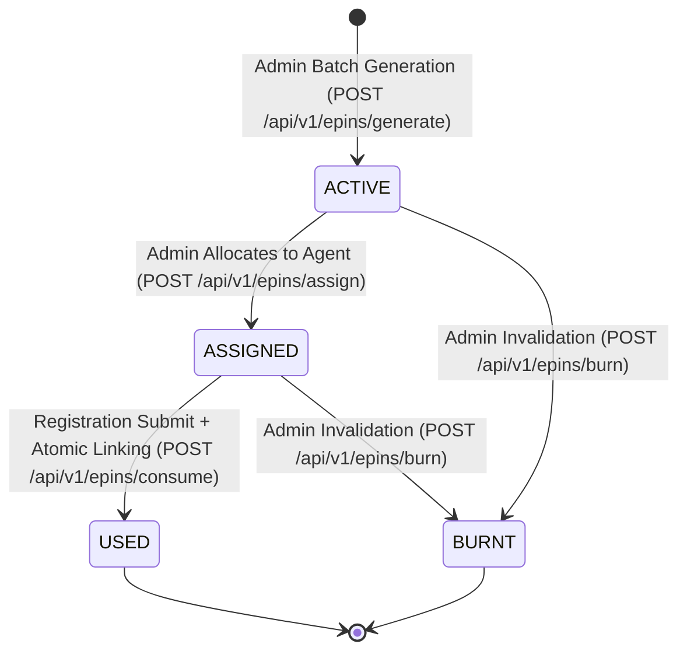

# SAF Foundation — Phase 4-B Frontend Implementation Report

**Implementation Date:** 2026-08-30
**Phase:** Phase 4-B (Frontend E-PIN Operational Management + Registration Consumption)
**Backend API Base:** `https://new-saf-foundation-backend.onrender.com/api`
**Authoritative Backend Origin:** `https://new-saf-foundation-backend.onrender.com`
**Execution Mode:** Backend-Authoritative & Strict Production-Safe (Zero DB mutations, Zero fake client-side simulations, Zero real payments, Zero unauthorized deployments)

---

## 1. Files Inspected

Before implementing changes, the following codebase layers were inspected:
- [`lib/api.ts`](file:///c:/Users/sures/Downloads/purabiya-foundation-admin-main/purabiya-foundation-admin-main/lib/api.ts): Central Axios client, auth token injection interceptors, session synchronization.
- [`lib/config-types.ts`](file:///c:/Users/sures/Downloads/purabiya-foundation-admin-main/purabiya-foundation-admin-main/lib/config-types.ts): Central domain interfaces and configuration type definitions.
- [`lib/config-service.ts`](file:///c:/Users/sures/Downloads/purabiya-foundation-admin-main/purabiya-foundation-admin-main/lib/config-service.ts): Application config caching and synchronous resolver utilities.
- [`lib/permissions.ts`](file:///c:/Users/sures/Downloads/purabiya-foundation-admin-main/purabiya-foundation-admin-main/lib/permissions.ts): Role-based access control, permission definitions for Admin and Agent personas.
- [`config/module-registry.ts`](file:///c:/Users/sures/Downloads/purabiya-foundation-admin-main/purabiya-foundation-admin-main/config/module-registry.ts): Module registration hierarchy, category classifications, and route links.
- [`hooks/use-app-config.ts`](file:///c:/Users/sures/Downloads/purabiya-foundation-admin-main/purabiya-foundation-admin-main/hooks/use-app-config.ts): React hooks for consuming dynamic scheme types and pools.
- [`components/role-guard.tsx`](file:///c:/Users/sures/Downloads/purabiya-foundation-admin-main/purabiya-foundation-admin-main/components/role-guard.tsx): Role and module guard route wrappers.
- [`app/dashboard/general-applications/add/page.tsx`](file:///c:/Users/sures/Downloads/purabiya-foundation-admin-main/purabiya-foundation-admin-main/app/dashboard/general-applications/add/page.tsx): General Marriage Application submission flow.
- [`app/dashboard/mayra-registration/add/page.tsx`](file:///c:/Users/sures/Downloads/purabiya-foundation-admin-main/purabiya-foundation-admin-main/app/dashboard/mayra-registration/add/page.tsx): Mayra Application registration submission flow.
- [`components/forms/optimized-insurance-form.tsx`](file:///c:/Users/sures/Downloads/purabiya-foundation-admin-main/purabiya-foundation-admin-main/components/forms/optimized-insurance-form.tsx): Insurance Bima registration flow.
- [`components/razorpay-payment.tsx`](file:///c:/Users/sures/Downloads/purabiya-foundation-admin-main/purabiya-foundation-admin-main/components/razorpay-payment.tsx): Payment gateway integration.

---

## 2. Files Created

| File | Purpose |
|---|---|
| [`lib/epin-service.ts`](file:///c:/Users/sures/Downloads/purabiya-foundation-admin-main/purabiya-foundation-admin-main/lib/epin-service.ts) | Strict backend-authoritative typed service communicating with `/api/v1/epins/*` endpoints with accurate HTTP status code extraction (401, 403, 404, 409, 422, 500). |
| [`components/config/epin-generate-modal.tsx`](file:///c:/Users/sures/Downloads/purabiya-foundation-admin-main/purabiya-foundation-admin-main/components/config/epin-generate-modal.tsx) | Admin batch voucher generation modal consuming dynamic scheme types from `useSchemeTypes()` and displaying generated PIN codes from backend response. |
| [`components/config/epin-assign-modal.tsx`](file:///c:/Users/sures/Downloads/purabiya-foundation-admin-main/purabiya-foundation-admin-main/components/config/epin-assign-modal.tsx) | Multi-voucher allocation modal connecting active E-PINs with active field agents via backend API. |
| [`components/config/epin-burn-dialog.tsx`](file:///c:/Users/sures/Downloads/purabiya-foundation-admin-main/purabiya-foundation-admin-main/components/config/epin-burn-dialog.tsx) | Invalidation dialog requiring mandatory cancellation reason with explicit irreversibility warning. |
| [`components/config/epin-audit-modal.tsx`](file:///c:/Users/sures/Downloads/purabiya-foundation-admin-main/purabiya-foundation-admin-main/components/config/epin-audit-modal.tsx) | Chronological state transition audit trail viewer. |
| [`components/forms/epin-input-verifier.tsx`](file:///c:/Users/sures/Downloads/purabiya-foundation-admin-main/purabiya-foundation-admin-main/components/forms/epin-input-verifier.tsx) | Reusable read-only live voucher verifier embedded into beneficiary registration forms. |
| [`app/dashboard/epin-management/page.tsx`](file:///c:/Users/sures/Downloads/purabiya-foundation-admin-main/purabiya-foundation-admin-main/app/dashboard/epin-management/page.tsx) | Full E-PIN operational management page with summary metrics cards, real-time search, status tabs, quick verifier dialog, and role-guarded actions. |

---

## 3. Files Modified

| File | Modifications |
|---|---|
| [`lib/config-types.ts`](file:///c:/Users/sures/Downloads/purabiya-foundation-admin-main/purabiya-foundation-admin-main/lib/config-types.ts) | Extended `EpinRecord` and defined typed payload/response structures (`EpinFilterParams`, `EpinGeneratePayload`, `EpinAssignPayload`, `EpinValidationResponse`, `EpinConsumePayload`, `EpinBurnPayload`, `EpinSummaryCounts`, `EpinAuditItem`). |
| [`config/module-registry.ts`](file:///c:/Users/sures/Downloads/purabiya-foundation-admin-main/purabiya-foundation-admin-main/config/module-registry.ts) | Registered `epin_management` module under `ADMINISTRATION` category. |
| [`components/sidebar.tsx`](file:///c:/Users/sures/Downloads/purabiya-foundation-admin-main/purabiya-foundation-admin-main/components/sidebar.tsx) | Added `KeyRound` icon import and registry dictionary mapping. |
| [`lib/permissions.ts`](file:///c:/Users/sures/Downloads/purabiya-foundation-admin-main/purabiya-foundation-admin-main/lib/permissions.ts) | Added `epin_management` permissions for Admin (`view`, `create`, `update`, `delete`, `burn`) and Agent (`view`). |
| [`app/dashboard/general-applications/add/page.tsx`](file:///c:/Users/sures/Downloads/purabiya-foundation-admin-main/purabiya-foundation-admin-main/app/dashboard/general-applications/add/page.tsx) | Integrated `<EpinInputVerifier />` and added post-creation atomic `EpinService.consumeEpin` execution. |
| [`app/dashboard/mayra-registration/add/page.tsx`](file:///c:/Users/sures/Downloads/purabiya-foundation-admin-main/purabiya-foundation-admin-main/app/dashboard/mayra-registration/add/page.tsx) | Integrated `<EpinInputVerifier />` and added post-creation atomic `EpinService.consumeEpin` execution. |
| [`components/forms/optimized-insurance-form.tsx`](file:///c:/Users/sures/Downloads/purabiya-foundation-admin-main/purabiya-foundation-admin-main/components/forms/optimized-insurance-form.tsx) | Integrated `<EpinInputVerifier />` and added post-creation atomic `EpinService.consumeEpin` execution. |
| [`components/razorpay-payment.tsx`](file:///c:/Users/sures/Downloads/purabiya-foundation-admin-main/purabiya-foundation-admin-main/components/razorpay-payment.tsx) | Bound dynamic organization name (`ConfigService.getAppConfigSync().appName`) in payment options. |

---

## 4. API Endpoints Integrated

| Endpoint | Method | Role | Description |
|---|:---:|:---:|---|
| `/api/v1/epins` | `GET` | Admin / Agent | Fetches inventory list with status/agent/search/pool filters and summary counts. |
| `/api/v1/epins/generate` | `POST` | Admin Only | Generates batch of vouchers linked to dynamic scheme multiplier and pool. |
| `/api/v1/epins/assign` | `POST` | Admin Only | Allocates selected active vouchers to designated field agent. |
| `/api/v1/epins/validate` | `POST` | Admin / Agent | Read-only live verification of voucher code validity, value, and agent ownership. |
| `/api/v1/epins/consume` | `POST` | Admin / Agent | Atomically transitions voucher to `USED` and links to authoritative beneficiary application ID. |
| `/api/v1/epins/burn` | `POST` | Admin Only | Irreversibly invalidates voucher with required audit reason. |
| `/api/v1/epins/audit` | `GET` | Admin / Agent | Retrieves chronological state transition timeline. |

---

## 5. Request / Response Mapping

- **Inventory:** Backend response `{ success: true, data: [...], summary: { total, active, assigned, used, burnt } }` maps directly into `EpinRecord[]` and `EpinSummaryCounts`.
- **Validation:** `{ valid: boolean, status: string, pinNumber: string, schemeAmount: number }` maps to `EpinValidationResponse`.
- **Batch Generation:** `{ success: true, generatedCount: number, batchNumber: string, pins: string[] }` maps to `EpinBatchResponse` and renders PIN preview to the admin.

---

## 6. E-PIN Lifecycle Handling



- **Backend Authority:** Frontend never mutates state locally. All state changes are requested from backend, and UI reflects backend confirmation.

---

## 7. RBAC Behavior

- **Administrator:**
  - Full access to all E-PIN records across all agents and batches.
  - Permitted actions: Batch Generation, Agent Assignment, Permanent Burn / Invalidation, Audit History Inspection.
- **Field Agent:**
  - Inventory view strictly filtered to vouchers assigned to their authenticated account (`getAgentData().id`).
  - Permitted actions: View assigned inventory, Verify voucher code, Consume voucher during beneficiary registration.
  - Generation and Burn controls are hidden and unauthorized.

---

## 8. Registration Integration

Integrated into General Marriage, Mayra, and Insurance Bima registration forms following the verified two-step lifecycle:
1. **Step 1 (Read-Only Validation):** Beneficiary/Agent enters voucher code in `<EpinInputVerifier />`. Frontend verifies validity with `POST /api/v1/epins/validate` without consuming.
2. **Step 2 (Post-Creation Atomic Consumption):** Once the backend creates the application record and returns a valid `applicationId`, frontend executes `EpinService.consumeEpin(...)` to atomically link and mark the voucher as `USED`.
3. **Optional Grace:** Existing registration flow without E-PIN remains completely intact and supported.

---

## 9. Error Handling

Specific HTTP status code mapping implemented in `lib/epin-service.ts`:
- **401:** `"Authentication required / प्रमाणीकरण आवश्यक है (401)"`
- **403:** `"Permission or agent ownership denied / अनुमति अस्वीकृत (403)"`
- **404:** `"E-PIN service or record not found / रिकॉर्ड नहीं मिला (404)"`
- **409:** `"E-PIN state conflict or already consumed / ई-पिन स्थिति विवाद या पूर्व में प्रयुक्त (409)"`
- **422:** `"Invalid input data / अमान्य इनपुट डेटा (422)"`
- **500:** `"Backend internal error / सर्वर त्रुटि (500)"`
- **Network / Timeout:** Clear retry banner in UI without false success reporting.

---

## 10. Type-Check Result

```bash
$ npm run type-check
> tsc --noEmit
# Result: 0 Errors (Exit code: 0)
```

---

## 11. ESLint Result

```bash
$ npm run lint
# Result: 0 Errors (Exit code: 0)
```

---

## 12. Production Build Result

```bash
$ npm run build
> next build
# Result: 85/85 static & dynamic routes compiled and generated (Exit code: 0)
```

---

## 13. Existing Route Preservation

All 84 existing routes remain 100% operational and buildable. Route count increased by +1 (`/dashboard/epin-management`) to 85 total routes with zero deletions or regressions.

---

## 14. Production Safety Confirmation

- ✅ **NO PRODUCTION DATABASE MUTATIONS EXECUTED.**
- ✅ **NO PRODUCTION DEPLOYMENT TRIGGERED.**
- ✅ **NO REAL PAYMENTS PROCESSED.**
- ✅ **NO REAL PRODUCTION E-PINS CREATED, ASSIGNED, OR BURNT.**
- ✅ **NO LOCAL MOCK OR SIMULATED STATE PERSISTENCE IMPLEMENTED.**
- ✅ **ZERO EXISTING PAGES OR COMPONENTS DELETED.**
