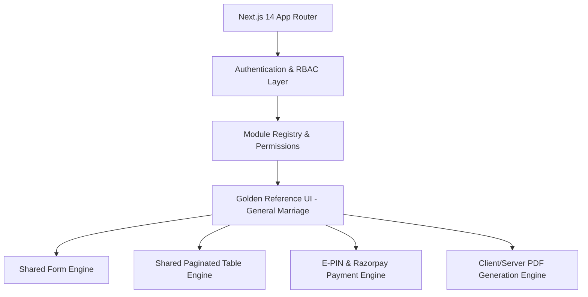

# SAF Foundation Admin Panel — Master Documentation System

> **Golden Reference Standard**: The **General Marriage Application (`/dashboard/general-applications`)** is the canonical UI/UX reference design for the entire SAF Foundation Frontend ecosystem. All existing and future modules must adhere to its layout, typography, sectioning, component structure, validation feedback, and interaction standards.

---

## 📚 Documentation Index

This repository contains the complete, authoritative documentation system for the SAF Foundation Frontend. Every document is grounded in verified source code and serves as the permanent reference for developers, designers, and system architects.

| Document | Purpose & Scope |
| :--- | :--- |
| **[Master Audit Report](file:///c:/Users/sures/Downloads/purabiya-foundation-admin-main/purabiya-foundation-admin-main/docs/SAF_FOUNDATION_FRONTEND_COMPLETE_AUDIT_REPORT.md)** | Executive overview, full repository discovery, module inventories, tech debt, and risk assessments. |
| **[Design System Specification](file:///c:/Users/sures/Downloads/purabiya-foundation-admin-main/purabiya-foundation-admin-main/docs/SAF_FOUNDATION_FRONTEND_DESIGN_SYSTEM.md)** | Official design tokens (Colors, Typography, Spacing, Elevation), UI component catalog, and responsive layouts. |
| **[Frontend Architecture](file:///c:/Users/sures/Downloads/purabiya-foundation-admin-main/purabiya-foundation-admin-main/docs/SAF_FOUNDATION_FRONTEND_ARCHITECTURE.md)** | App Router structure, component hierarchy, state flow, auth/RBAC, file uploads, and PDF engine. |
| **[Validation Rules Matrix](file:///c:/Users/sures/Downloads/purabiya-foundation-admin-main/purabiya-foundation-admin-main/docs/SAF_FOUNDATION_FRONTEND_VALIDATION_RULES.md)** | Complete field-level validation rules, regex patterns, sanitization logic, and edge-case handling. |
| **[Business & Frontend Logic](file:///c:/Users/sures/Downloads/purabiya-foundation-admin-main/purabiya-foundation-admin-main/docs/SAF_FOUNDATION_FRONTEND_LOGIC_README.md)** | End-to-end user workflows, lifecycle diagrams, data transformations, E-PIN mechanics, and payment flows. |
| **[Module-Wise Logic & Status](file:///c:/Users/sures/Downloads/purabiya-foundation-admin-main/purabiya-foundation-admin-main/docs/SAF_FOUNDATION_MODULE_LOGIC.md)** | Deep-dive into all 23+ modules, comparing each against the General Marriage standard. |
| **[API & Payload Contracts](file:///c:/Users/sures/Downloads/purabiya-foundation-admin-main/purabiya-foundation-admin-main/docs/SAF_FOUNDATION_FRONTEND_API_CONTRACT.md)** | Comprehensive frontend-to-backend API contracts, FormData specifications, and legacy field mappings. |
| **[Master Form Field Registry](file:///c:/Users/sures/Downloads/purabiya-foundation-admin-main/purabiya-foundation-admin-main/docs/SAF_FOUNDATION_FORM_FIELD_REGISTRY.md)** | Exhaustive field registry across all modules detailing types, constraints, aliases, and behavior. |
| **[UI Consistency Audit](file:///c:/Users/sures/Downloads/purabiya-foundation-admin-main/purabiya-foundation-admin-main/docs/SAF_FOUNDATION_UI_CONSISTENCY_AUDIT.md)** | Gap analysis evaluating all modules against the Golden Reference design system. |
| **[Frontend Development Rules](file:///c:/Users/sures/Downloads/purabiya-foundation-admin-main/purabiya-foundation-admin-main/docs/SAF_FOUNDATION_FRONTEND_DEVELOPMENT_RULES.md)** | Step-by-step developer guidelines, implementation checklists, and strict architectural "DO NOTs". |

---

## 🏛️ Core Principles & Architecture Summary

1. **Golden Reference UI**: The General Marriage module sets the visual, structural, and behavioral benchmark for all user interfaces.
2. **Separation of Concerns**: Design patterns and component architectures are standardized, while business rules (e.g. age limits, pricing slabs, grant disbursals) remain strictly decoupled per module.
3. **Multi-layer Resilience**: Graceful fallbacks for legacy PHP API payloads, dual-field aliases, dynamic base URL resolvers, and robust offline form number preservation.
4. **Strict Security & Verification**: Role-based access control (RBAC), E-PIN cryptographic verification, and non-destructive image handling.
