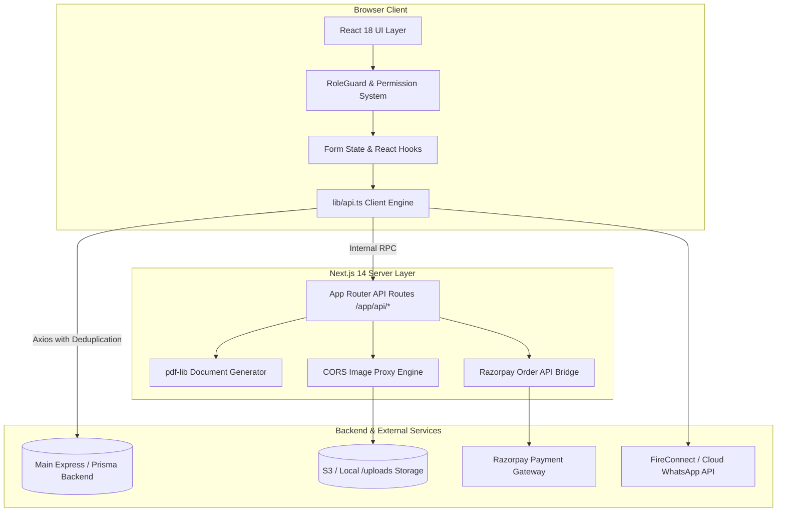
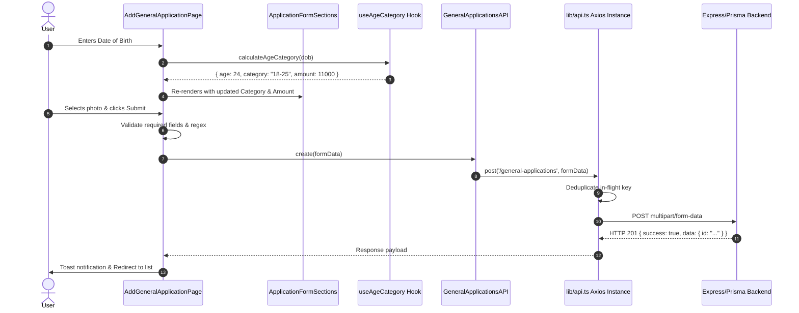
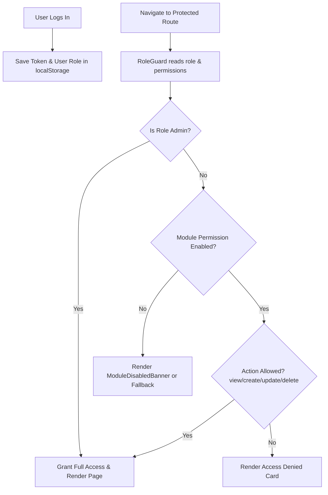
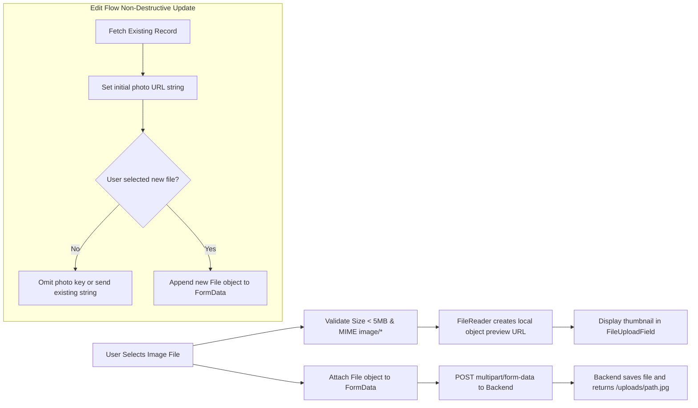
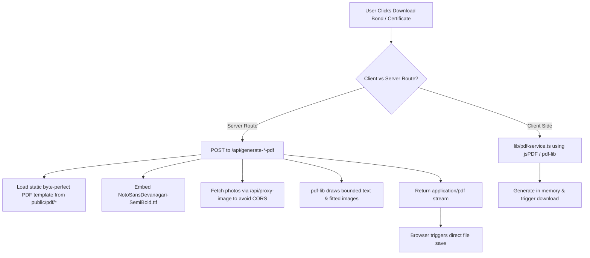
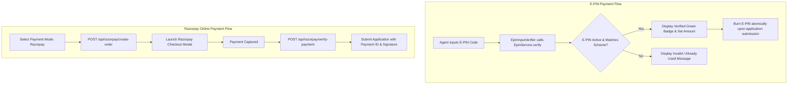

# SAF Foundation Frontend — Technical Architecture Document

---

## 1. System Architecture Overview

The SAF Foundation frontend is an enterprise web application engineered with **Next.js 14 App Router**, **React 18**, **TypeScript 5**, **Tailwind CSS**, and **Radix UI**. It interfaces with both a modern Node.js/Express/Prisma backend and legacy PHP endpoints while executing complex client and server-side document rendering.



---

## 2. Layer-by-Layer Architectural Decomposition

### 🏗️ 2.1 Page → Component → Hook → Service → API Flow



---

## 3. Core Architectural Subsystems

### 🛡️ 3.1 Authentication & Authorization Architecture (RBAC)

The application implements a multi-tier Role-Based Access Control (RBAC) system defined in `lib/permissions.ts` and enforced via `components/role-guard.tsx`.



- **Roles**: `admin`, `agent`, `manager`, `user`.
- **Granular Actions**: `view`, `create`, `update`, `delete`.
- **Dynamic Feature Flags**: Admins can enable or disable entire modules at runtime via `/dashboard/settings/configuration`. When a module is turned off, `RoleGuard` immediately renders a non-destructive `ModuleDisabledBanner`.

---

### 📝 3.2 Form Architecture & Dual Form Number Handling

Forms are constructed using modular section components in `components/forms/application-form-sections.tsx`.

1. **State Isolation**: Form state is held in parent page components using standard typed interfaces (`GeneralApplication`, `InsuranceApplication`, etc.).
2. **Dual Form Numbers**:
   - `formNumber`: System-generated unique identifier (e.g. `APP-2026-00123`).
   - `offlineFormNumber`: Physical paper booklet sequence number entered manually by agents (e.g. `"005"`, `"042"`). The frontend preserves leading zeros as explicit strings without coercing to numbers.
3. **Dynamic Fee Calculation**: `hooks/use-age-category.ts` binds DOB changes to instant calculation of applicant age, age category slab, and associated registration fee.

---

### 🖼️ 3.3 Photo & File Upload Architecture



---

### 📄 3.4 PDF Generation & Rendering Architecture

The platform supports dual PDF generation pipelines:



- **Byte-Perfect Template Integrity**: Official templates in `public/pdf/` are protected with cryptographic SHA-256 hashes.
- **Photo Inset Fitting**: Photos are scaled proportionally with cover/center clipping to fit inside template frames without covering decorative borders.

---

### 💳 3.5 E-PIN & Payment Subsystems



---

## 4. Resilience & Legacy Compatibility

1. **Request Deduplication**: `lib/api.ts` maintains an in-flight `Map<string, Promise>` matching method, URL, and serialized payload (including file hashes) to eliminate duplicate network traffic.
2. **Dual-Key Alias Resilience**: All service mappers safely consume both camelCase and snake_case properties:
   ```typescript
   const offlineNo = record.offlineFormNumber ?? record.offline_form_number ?? '';
   const nomineeAadhar = record.nomineeAadhar ?? record.nomineeAadhaar ?? record.nominee_aadhar ?? '';
   ```
3. **URL Normalizer**: `resolvePhotoUrl()` in `lib/utils.ts` handles relative paths (`/uploads/`), absolute URLs (`https://`), base64 data strings, and legacy PHP directory formats (`/purbiya/api/user/`).
