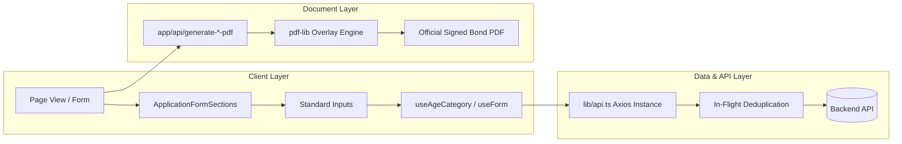

# SAF Foundation Frontend — Complete Project Audit Report

**Audit Date**: September 22, 2026
**Project**: SAF Foundation Admin Panel Frontend
**Framework**: Next.js 14 (App Router), React 18, TypeScript 5, Tailwind CSS, Radix UI
**Primary Golden Reference Module**: General Marriage Application (`app/dashboard/general-applications`)

---

## 1. Executive Summary

A comprehensive, non-destructive, read-only architectural audit was conducted across the entire SAF Foundation Admin Panel frontend codebase. The platform manages complex non-profit social welfare schemes, beneficiary registrations, financial assistance applications, agent hierarchies, bulk monthly EMI collections, E-PIN distribution, and official bond/certificate PDF generation.

The audit verified **85+ application pages**, **35+ API routes**, **25+ core service modules**, **60+ UI components**, and **12 dedicated PDF rendering pipelines**. The platform exhibits high resilience through adaptive API fallbacks, legacy PHP compatibility layers, and strict bilingual English/Hindi interface components.

---

## 2. Complete Repository & Directory Structure

```
purabiya-foundation-admin-main/
├── app/
│   ├── api/                                # Next.js Server Route Handlers (PDFs, Razorpay, WhatsApp, Image Proxy)
│   │   ├── fill-pdf-form/route.ts          # Offline form PDF filler
│   │   ├── generate-*-pdf/route.ts         # Server-side PDF generation routes (pdf-lib)
│   │   ├── proxy-image/route.ts            # CORS-safe image proxy for PDF rendering
│   │   └── razorpay/*/route.ts             # Payment creation & verification
│   ├── dashboard/                          # Dashboard & Module Pages (App Router)
│   │   ├── aawas/                          # Aawas (Housing) Registration Module
│   │   ├── agent-commission/               # Agent Commission Disbursal
│   │   ├── agent-commission-report/        # Agent Commission Performance Reports
│   │   ├── agent-permission/               # Agent RBAC Management
│   │   ├── agent-registration/             # Agent Onboarding & Hierarchy
│   │   ├── bulk-marriage-emi/              # Bulk Marriage Scheme EMI Collector
│   │   ├── bulk-mayra-emi/                 # Bulk Mayra Scheme EMI Collector
│   │   ├── bulk-suraksha-bima-emi/         # Bulk Insurance Scheme EMI Collector
│   │   ├── dhundhotsav/                    # Dhundhotsav Child Welfare Scheme
│   │   ├── disability-cycle/               # Disability Assistance (Disabled flag)
│   │   ├── epin-management/                # E-PIN Inventory, Generation, Burning
│   │   ├── financal-help/                  # Financial Grant Applications
│   │   ├── general-applications/           # [GOLDEN REFERENCE] General Marriage
│   │   ├── general-applications-insurance/ # Insurance Bima Registration
│   │   ├── janni-delivery/                 # Janni Suraksha Maternity Scheme
│   │   ├── lado-bahin/                     # Lado Bahin Scheme
│   │   ├── loan-application/               # Balika Loan Scheme
│   │   ├── marriage-congratulations/       # Marriage Congratulations & Gifts
│   │   ├── mayra-congratulations/          # Mayra Congratulations
│   │   ├── mayra-registration/             # Mayra General Registration
│   │   ├── payment-management/             # Centralized Payment Tracking & Cash Flow
│   │   ├── pension-yojana/                 # Pension Scheme (Disabled flag)
│   │   ├── settings/configuration/         # System Config & Feature Flags
│   │   ├── sewing-machine/                 # Sewing Machine Camp (Disabled flag)
│   │   ├── shubh-laxmi/                    # ShubhLaxmi Deepawali Scheme
│   │   ├── suraksha-bima-yojana/           # Suraksha Bima Module
│   │   └── page.tsx                        # Dashboard Analytics Overview
│   ├── debug/whatsapp/                     # WhatsApp Integration Debugger
│   ├── globals.css                         # Core CSS & Theme Tokens
│   ├── layout.tsx                          # Root HTML Layout & Theme Provider
│   └── page.tsx                            # Root Authentication / Login Screen
├── components/
│   ├── bulk-emi/                           # Reusable Bulk EMI Collection Engines
│   ├── config/                             # E-PIN, Status Badges & Slabs
│   ├── forms/                              # Standardized Form Sections & Inputs
│   │   ├── application-form-sections.tsx   # [GOLDEN REFERENCE] Core Form Sections
│   │   ├── date-picker-field.tsx           # Bilingual Calendar Input
│   │   ├── epin-input-verifier.tsx         # Real-time E-PIN Validator
│   │   ├── file-upload-field.tsx           # Photo Uploader & Image Cropper
│   │   ├── input-field.tsx                 # Standardized Text/Number Input
│   │   ├── optimized-insurance-form.tsx    # High-Performance Form Engine
│   │   └── select-field.tsx                # Standardized Dropdown Input
│   ├── payment/                            # Reusable Payment Dialogs & Slips
│   ├── ui/                                 # Radix UI + Tailwind Primitives
│   ├── data-table.tsx                      # Legacy Table
│   ├── optimized-data-table.tsx            # Optimized Fast Table
│   ├── paginated-table-section.tsx         # [GOLDEN REFERENCE] Master Paginated Table
│   ├── role-guard.tsx                      # Client-side RBAC Guard
│   └── sidebar.tsx                         # Master Navigation Sidebar
├── config/
│   └── module-registry.ts                  # Central Module Metadata & Routing
├── hooks/                                  # Custom React Hooks
│   ├── use-age-category.ts                 # Dynamic Age Slab & Fee Engine
│   ├── use-app-config.ts                   # System Config & Pricing Hook
│   ├── use-crud.ts                         # Universal Data Fetching & Mutation
│   ├── use-permissions.ts                  # RBAC Permission Hook
│   └── use-table-pagination.ts             # Server/Client Pagination Engine
├── lib/                                    # Core Utilities, Services & APIs
│   ├── api.ts                              # Axios HTTP Client with In-Flight Deduplication
│   ├── api-url.ts                          # Dynamic API Base URL Resolver
│   ├── config-service.ts                   # System Settings Service
│   ├── epin-service.ts                     # E-PIN Lifecycle Engine
│   ├── form-values.ts                      # Universal Enum Constants
│   ├── permissions.ts                      # RBAC Permission Definitions
│   ├── pdf-service.ts                      # Client-Side PDF Generator Bridge
│   ├── services.ts                         # Unified Entity Service Layer
│   ├── translations.ts                     # Bilingual (EN/HI) Dictionary
│   ├── utils.ts                            # Date, String, Photo URL Resolvers
│   └── whatsapp-service.ts                 # Real-time Cloud API Notifier
└── public/                                 # Static Assets & PDF Templates
    └── pdf/                                # 12 Byte-Perfect Official PDF Templates
```

---

## 3. Complete Module Inventory & Status

| # | Module Name | Route | Category | Status | Remarks / Notes |
| :--- | :--- | :--- | :--- | :--- | :--- |
| 1 | **General Marriage** | `/dashboard/general-applications` | SCHEME | **IMPLEMENTED** | **GOLDEN REFERENCE** (Add, Edit, List, Filter, PDF, E-PIN, Razorpay) |
| 2 | **Mayra General Registration** | `/dashboard/mayra-registration` | SCHEME | **IMPLEMENTED** | Fully aligned with Golden Reference. Installment tracking included. |
| 3 | **Mayra Congratulations** | `/dashboard/mayra-congratulations` | SCHEME | **IMPLEMENTED** | Disbursal gift tracking with payment receipts. |
| 4 | **Insurance Bima** | `/dashboard/general-applications-insurance` | SCHEME | **IMPLEMENTED** | Fixed ₹300 installment, dual-photo Nominee/Applicant bond. |
| 5 | **Suraksha Bima Yojana** | `/dashboard/suraksha-bima-yojana` | SCHEME | **IMPLEMENTED** | Variant insurance scheme with monthly tracking. |
| 6 | **Janni Delivery** | `/dashboard/janni-delivery` | SCHEME | **IMPLEMENTED** | Maternity welfare with grant payment sub-page. |
| 7 | **Aawas / Housing** | `/dashboard/aawas` | SCHEME | **IMPLEMENTED** | Housing assistance grant application. |
| 8 | **Lado Bahin** | `/dashboard/lado-bahin` | SCHEME | **IMPLEMENTED** | Girl-child financial welfare scheme. |
| 9 | **Dhundhotsav Registration** | `/dashboard/dhundhotsav` | SCHEME | **IMPLEMENTED** | Infant cultural celebration assistance scheme. |
| 10 | **ShubhLaxmi (Deepawali)** | `/dashboard/shubh-laxmi` | SCHEME | **IMPLEMENTED** | Festive assistance scheme. |
| 11 | **Balika Loan Application** | `/dashboard/loan-application` | FINANCIAL | **IMPLEMENTED** | Educational & marriage loans for daughters. |
| 12 | **Financial Help / Sahayata** | `/dashboard/financal-help` | FINANCIAL | **IMPLEMENTED** | Emergency financial grants. |
| 13 | **Marriage Congratulations** | `/dashboard/marriage-congratulations` | SCHEME | **IMPLEMENTED** | Post-marriage gift disbursal & sewing machine sub-routes. |
| 14 | **Agent Registration** | `/dashboard/agent-registration` | ADMIN | **IMPLEMENTED** | Onboarding, hierarchy tracking, identity card generation. |
| 15 | **Agent Permission** | `/dashboard/agent-permission` | ADMIN | **IMPLEMENTED** | Granular module action grants for agents. |
| 16 | **Agent Commission Payment** | `/dashboard/agent-commission` | FINANCIAL | **IMPLEMENTED** | Monthly agent payout calculations. |
| 17 | **Agent Commission Report** | `/dashboard/agent-commission-report` | REPORT | **IMPLEMENTED** | Performance and commission logs. |
| 18 | **Bulk Marriage EMI** | `/dashboard/bulk-marriage-emi` | FINANCIAL | **IMPLEMENTED** | Multi-member receipt collection in single batch. |
| 19 | **Bulk Mayra EMI** | `/dashboard/bulk-mayra-emi` | FINANCIAL | **IMPLEMENTED** | Multi-member Mayra batch collector. |
| 20 | **Bulk Insurance EMI** | `/dashboard/bulk-suraksha-bima-emi` | FINANCIAL | **IMPLEMENTED** | Multi-member Insurance batch collector. |
| 21 | **E-PIN Management** | `/dashboard/epin-management` | ADMIN | **IMPLEMENTED** | Inventory, pool allocation, audit log, generation. |
| 22 | **Payment Management** | `/dashboard/payment-management` | FINANCIAL | **IMPLEMENTED** | Unified cash-flow ledger across all schemes. |
| 23 | **Configuration & Settings** | `/dashboard/settings/configuration` | ADMIN | **IMPLEMENTED** | Feature flags, dynamic fee slab editor, system pools. |
| 24 | **Disability Cycle** | `/dashboard/disability-cycle` | SCHEME | **DISABLED** | Gracefully hidden via Feature Flag in Module Registry. |
| 25 | **Sewing Machine Camp** | `/dashboard/sewing-machine` | SCHEME | **DISABLED** | Gracefully hidden via Feature Flag in Module Registry. |
| 26 | **Pension Yojana** | `/dashboard/pension-yojana` | SCHEME | **DISABLED** | Gracefully hidden via Feature Flag in Module Registry. |

---

## 4. Key Architectural Discoveries



1. **Request Deduplication**: `lib/api.ts` implements an in-flight request deduplicator that serializes both JSON and multipart `FormData` to prevent double-submissions from frantic user clicks.
2. **Dynamic Base URL Resolution**: `lib/api-url.ts` dynamically switches between explicit environment overrides (`NEXT_PUBLIC_API_URL`), origin inference, and fallback defaults (`http://localhost:5000/api`).
3. **Dual Form Number Architecture**: The system cleanly manages both auto-generated system `formNumber` and pre-printed physical `offlineFormNumber` (preserving leading zeros, e.g., `"005"`).
4. **Non-Destructive Image Updates**: The edit pages retain existing remote/stored image URLs when no new file is selected, avoiding accidental photo erasure.
5. **Exact PDF Geometry Overlay**: Server-side PDF routes map form data onto pre-designed official PDF bond templates with point-perfect coordinate precision ($72\text{ DPI}$).

---

## 5. Technical Debt & Risk Analysis

| Area | Observation | Risk Level | Recommendation |
| :--- | :--- | :--- | :--- |
| **Legacy Form Aliases** | API responses contain mixed naming styles (`offlineFormNumber` vs `offline_form_number`, `nomineeAadhar` vs `nomineeAadhaar`). | Low | Maintained safely via fallback helper functions in `lib/services.ts`. |
| **Bilingual Fonts in PDF** | Standard PDF fonts cannot render Devanagari script; routes embed `NotoSansDevanagari-SemiBold.ttf`. | Controlled | Embedded font loader is fully operational across all bond routes. |
| **E-PIN Concurrent Burning** | Multiple browser tabs attempting to burn the same E-PIN simultaneously. | Low | Backend handles atomic transaction locks; frontend verifies validity prior to submit. |
