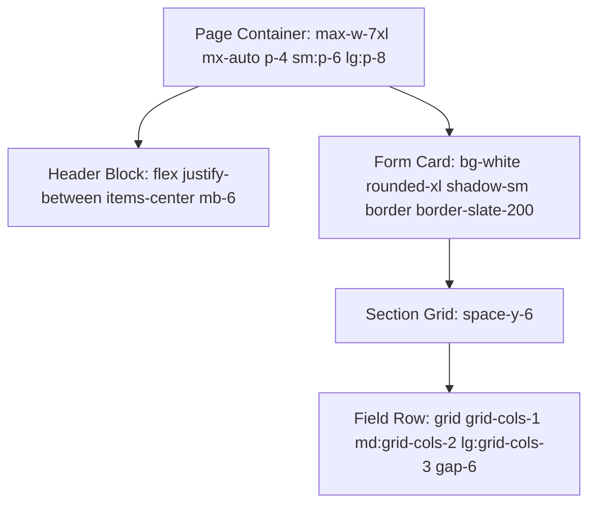

# SAF Foundation Frontend — Design System Specification

> **Golden Reference Standard**: The **General Marriage Application (`/dashboard/general-applications`)** is the primary visual and behavioral benchmark. All forms, tables, modals, badges, and layout primitives across all modules must adhere to the tokens and guidelines defined below.

---

## 1. Design Philosophy & Aesthetic Principles

1. **Trust & Dignity**: The SAF Foundation admin interface serves grassroots workers, administrators, and beneficiaries. Visual clarity, high readability, and clean contrast take precedence over decorative clutter.
2. **Bilingual Harmony**: All user-facing labels, table headers, validation errors, and confirmation modals support simultaneous English and Hindi (Devanagari) rendering.
3. **Information Density with Breathing Room**: Forms use structured, collapsible or cleanly separated card sections with generous whitespace (`gap-6`, `p-6`) to prevent cognitive overload during lengthy 20+ field submissions.
4. **Immediate & Unambiguous Feedback**: Every action (submit, verify E-PIN, upload photo, initiate Razorpay payment, download PDF) must display immediate visual state changes (spinners, disabled states, toast alerts).

---

## 2. Color System & Design Tokens

The color palette is derived directly from `tailwind.config.ts` and `app/globals.css`, blending Royal Navy Blue with Forest Green and Saffron Orange.

### 🎨 Brand & Functional Color Tokens

| Token Name | Hex Code | HSL / CSS Variable | Purpose & Semantic Meaning |
| :--- | :--- | :--- | :--- |
| **SAF Royal Blue (Primary)** | `#0B4A8F` | `212 85% 30%` (`--primary`) | Brand identity, primary submit buttons, active navigation items, table headers. |
| **SAF Dark Navy** | `#071E3D` | `--saf-blue-dark` | Sidebar background, header banners, hero card gradients. |
| **SAF Forest Green (Secondary)** | `#15803D` | `142 71% 29%` (`--secondary`) | Success states, paid badges, active E-PIN status, verify confirmations. |
| **SAF Saffron Orange (Accent)** | `#F57C00` | `28 95% 48%` (`--accent`) | Highlighting pending items, warning badges, action triggers, secondary CTAs. |
| **Background (Light Slate)** | `#F8FAFC` | `210 20% 98%` (`--background`) | Page canvas background. |
| **Card / Surface Background** | `#FFFFFF` | `0 0% 100%` (`--card`) | Form containers, modal bodies, table wrappers. |
| **Text Foreground (Dark Navy-Gray)** | `#0F172A` | `222.2 84% 4.9%` (`--foreground`) | Primary headings, body copy, form field input values. |
| **Muted Text (Slate-500)** | `#64748B` | `215.4 16.3% 46.9%` (`--muted-foreground`)| Subtitles, bilingual hints, placeholders, helper text. |
| **Borders & Dividers** | `#E2E8F0` | `214.3 31.8% 91.4%` (`--border`) | Card outlines, table grid lines, input field borders. |
| **Destructive / Error (Rose-600)** | `#E11D48` | `0 84.2% 60.2%` (`--destructive`) | Validation error messages, delete triggers, rejection badges. |

### 🌈 Utility Gradients
- **Primary Hero Gradient**: `linear-gradient(135deg, #071E3D 0%, #0B4A8F 50%, #15803D 100%)`
- **Card Accent Gradient**: `linear-gradient(135deg, #F57C00 0%, #EA580C 100%)`

---

## 3. Typography System

The interface uses standard system sans fonts (`Inter`, `system-ui`, `-apple-system`) paired with `Noto Sans Devanagari` for Hindi script rendering.

| Scale Level | Class Name | Size / Line Height | Weight | Usage |
| :--- | :--- | :--- | :--- | :--- |
| **Page Title** | `text-2xl sm:text-3xl` | `24px / 32px` | Bold (`font-bold`) | Main page title at the top of lists and forms. |
| **Section Header** | `text-lg sm:text-xl` | `18px / 28px` | Semibold (`font-semibold`) | Card titles (e.g. "Personal Information", "Nominee Details"). |
| **Subheadings** | `text-base` | `16px / 24px` | Medium (`font-medium`) | Modal headers, tab triggers, stat card titles. |
| **Body / Input Text** | `text-sm` | `14px / 20px` | Normal (`font-normal`) | Form inputs, dropdown values, table row cells. |
| **Field Labels** | `text-sm` | `14px / 20px` | Medium (`font-medium`) | Labels above input boxes (English & Hindi combined). |
| **Caption / Helper** | `text-xs` | `12px / 16px` | Normal (`font-normal`) | Error text, photo size limits, timestamp subtext. |

### 🌐 Bilingual Label Formatting Standard
Always format bilingual field labels using the following pattern:
```tsx
<Label className="text-sm font-medium text-slate-700">
  Applicant Name / आवेदक का नाम <span className="text-rose-500">*</span>
</Label>
```

---

## 4. Spacing, Layout & Elevation Hierarchy



- **Container**: `max-w-7xl mx-auto p-4 sm:p-6 lg:p-8`
- **Card Spacing**: `p-6` on desktop, `p-4` on mobile. Rounded corners: `rounded-xl` (`12px`) or `rounded-lg` (`8px`).
- **Form Row Gap**: `gap-6` (`24px`) between input columns.
- **Section Stack**: `space-y-6` (`24px`) between distinct form card sections.
- **Elevations**:
  - Cards: `shadow-sm` (`0 1px 2px 0 rgb(0 0 0 / 0.05)`)
  - Dropdowns & Popovers: `shadow-md` (`0 4px 6px -1px rgb(0 0 0 / 0.1)`)
  - Modals & Dialogs: `shadow-xl` (`0 20px 25px -5px rgb(0 0 0 / 0.1)`)

---

## 5. UI Component Library Standards

### 🔘 1. Buttons (`components/ui/button.tsx`)
- **Primary Action**: `className="bg-[#0B4A8F] hover:bg-[#072E5C] text-white font-medium px-6 py-2.5 rounded-lg shadow-sm transition-all flex items-center gap-2"`
- **Secondary / Cancel**: `variant="outline" className="border-slate-300 text-slate-700 hover:bg-slate-50"`
- **Destructive / Delete**: `variant="destructive" className="bg-rose-600 hover:bg-rose-700 text-white"`
- **Success / Verify**: `className="bg-emerald-600 hover:bg-emerald-700 text-white"`

### 📝 2. Input Fields (`components/ui/input.tsx`)
- **Default State**: `h-10 px-3.5 py-2 rounded-lg border border-slate-300 bg-white text-slate-900 text-sm focus:outline-none focus:ring-2 focus:ring-[#0B4A8F] focus:border-transparent transition-all`
- **Error State**: `border-rose-500 focus:ring-rose-500`
- **Disabled State**: `bg-slate-100 text-slate-500 cursor-not-allowed border-slate-200`

### 📅 3. Date Picker (`components/forms/date-picker-field.tsx` & `components/ui/date-picker.tsx`)
- Combines a text button trigger with a calendar popover, supporting `DD/MM/YYYY` format display and automatic date parsing.

### 🖼️ 4. File Upload & Photo Preview (`components/forms/file-upload-field.tsx`)
- **Dropzone Area**: Dashed border (`border-2 border-dashed border-slate-300 hover:border-[#0B4A8F] bg-slate-50/50 rounded-xl p-6 text-center cursor-pointer transition-all`).
- **Live Preview**: Thumbnail image (`w-24 h-28 object-cover rounded-lg border border-slate-200 shadow-sm`) with a quick remove/replace button.

### 📊 5. Master Paginated Table (`components/paginated-table-section.tsx`)
- **Header**: Dark or Navy header styling with crisp white/slate text (`bg-[#071E3D] text-white font-semibold text-xs uppercase tracking-wider py-3.5 px-4`).
- **Rows**: Alternating subtle zebra striping (`hover:bg-slate-50/80 transition-colors border-b border-slate-100`).
- **Action Buttons**: Icon buttons for View (Eye), Edit (Pencil), Download PDF (FileDown), and Delete (Trash2).

### 🏷️ 6. Status Badges (`components/config/status-badge.tsx`)
- **Paid / Approved**: `bg-emerald-50 text-emerald-700 border-emerald-200`
- **Pending / In-Review**: `bg-amber-50 text-amber-700 border-amber-200`
- **Rejected / Expired**: `bg-rose-50 text-rose-700 border-rose-200`
- **E-PIN Allocated**: `bg-blue-50 text-blue-700 border-blue-200`

---

## 6. Responsive Layout Breakpoints

- **Mobile (`< 640px`)**:
  - Forms collapse into a single column (`grid-cols-1`).
  - Navigation sidebar collapses into a slide-over sheet drawer.
  - Tables become horizontally scrollable (`overflow-x-auto`) with sticky action columns.
- **Tablet (`640px - 1024px`)**:
  - Forms use 2 columns (`grid-cols-2`).
  - Stat cards display in a 2x2 grid.
- **Desktop (`>= 1024px`)**:
  - Forms use 3 columns for concise fields (e.g. State, District, Tehsil) and 2 columns for wider fields.
  - Full static left sidebar navigation with collapsible scheme groups.
