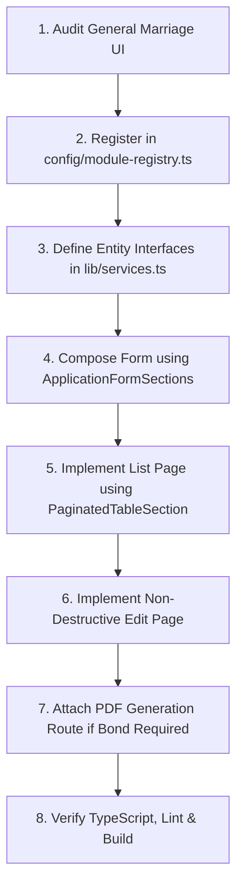

# SAF Foundation Frontend — Developer Rulebook & Extension Guidelines

> **Golden Reference Standard**: The **General Marriage Application (`/dashboard/general-applications`)** is the primary UI/UX reference design. Every new scheme, financial feature, or administrative tool must follow this rulebook to maintain architectural integrity.

---

## 1. Step-by-Step Module Creation Workflow

### 📋 Phase-by-Phase Checklist

1. **Step 1: Audit General Marriage First**
   - Review `/app/dashboard/general-applications/page.tsx` and `add/page.tsx`.
   - Identify which sections (`Personal`, `Family`, `Address`, `Nominee`, `Agent`, `Payment`, `Document`) apply to your new module.
2. **Step 2: Register in Module Registry**
   - Add the module entry to `config/module-registry.ts` with bilingual names, route, icon, and default enabled flag.
   - Configure corresponding permissions in `lib/permissions.ts`.
3. **Step 3: Define TypeScript Contracts & Services**
   - Add the entity interface to `lib/services.ts`.
   - Implement the CRUD service wrapper using the standard `api.get()`, `api.post()`, `api.put()`, `api.delete()` methods from `lib/api.ts`.
   - Include legacy field fallback mappings in the service response parser.
4. **Step 4: Build Add & Edit Pages**
   - Use `RoleGuard` to wrap the page with required module permissions.
   - Use `ApplicationFormSections` for standardized card layouts.
   - Bind `useAgeCategory` or custom pricing hooks for dynamic fee calculation.
   - Use `FileUploadField` for images, preserving existing photo URLs in Edit mode.
5. **Step 5: Build Paginated List Page**
   - Use `PaginatedTableSection` or `OptimizedDataTable`.
   - Include search filters (Name, Mobile, Aadhaar, Form No), status badges, and action dropdowns (View, Edit, Download PDF, Delete).
6. **Step 6: PDF Bond Generation (If Applicable)**
   - Create a dedicated route in `/app/api/generate-<scheme>-pdf/route.ts`.
   - Use `pdf-lib` to overlay text on official templates from `/public/pdf/`.
   - Load `NotoSansDevanagari-SemiBold.ttf` for Hindi script rendering.
   - Validate that official PDF templates maintain exact SHA-256 hash integrity.
7. **Step 7: Quality Assurance & Build Verification**
   - Run `npm run type-check` (Zero TypeScript errors).
   - Run `npm run lint` (Zero ESLint warnings/errors).
   - Run `npm run build` (Successful Next.js production compilation).

---

## 2. Strict Architectural "DO NOT" Rules

- ❌ **DO NOT** create ad-hoc custom CSS or inline styles when standard Tailwind classes and tokens (`bg-[#0B4A8F]`, `rounded-xl`, `p-6`) exist.
- ❌ **DO NOT** create a new form layout when `ApplicationFormSections` satisfies the requirement.
- ❌ **DO NOT** modify or overwrite the General Marriage styling without explicit foundation-wide architectural sign-off.
- ❌ **DO NOT** blindly copy business logic (such as age category fees or grant amounts) between different schemes without verifying their specific business rules.
- ❌ **DO NOT** mix up applicant and nominee photos. Ensure `passportPhoto` and `nomineePhoto` retain dedicated form properties, API keys, and PDF coordinates.
- ❌ **DO NOT** change backend API field names without adding dual-key fallback normalizers for legacy compatibility.
- ❌ **DO NOT** modify the byte contents or dimensions of official PDF templates in `public/pdf/`.
- ❌ **DO NOT** consume real E-PINs or initiate live financial transactions during development testing.
- ❌ **DO NOT** wipe out existing photo paths on Edit form submissions when a user does not upload a replacement file.
