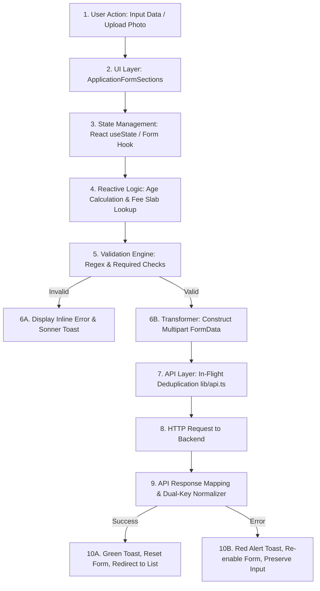
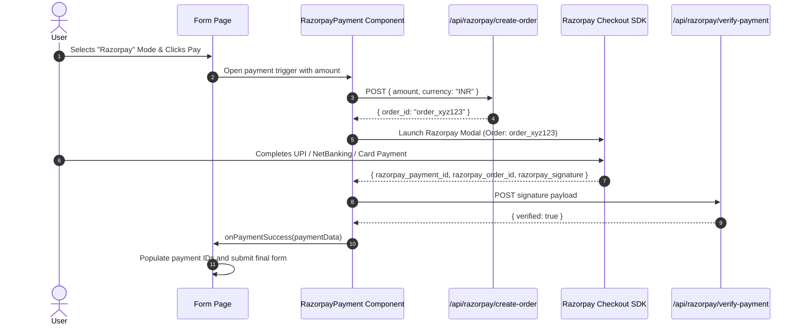
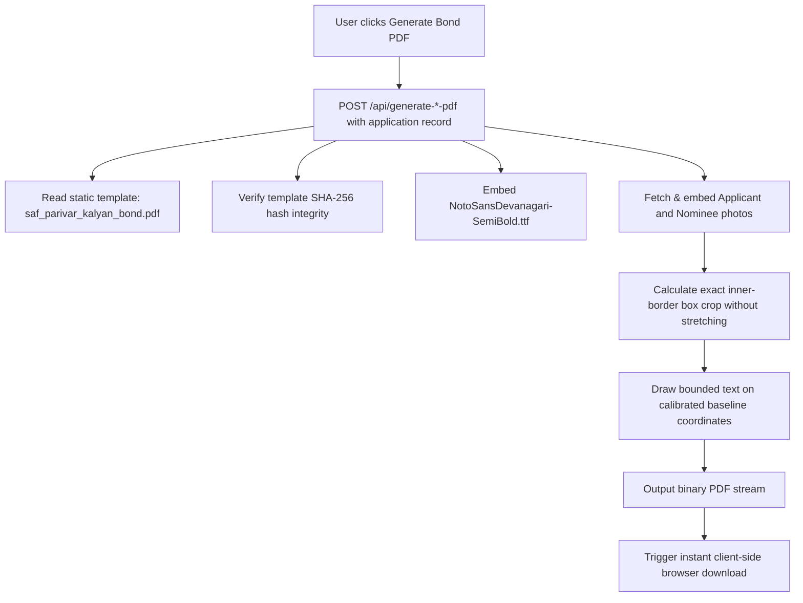

# SAF Foundation Frontend — Business & Application Logic Manual

> **Golden Reference Standard**: All business flows, form lifecycles, and transaction pipelines across SAF Foundation modules mirror the canonical implementation established in the **General Marriage Application (`/dashboard/general-applications`)**.

---

## 1. Master Application Lifecycle & Data Flow

Every beneficiary application creation, update, and lifecycle transition follows a strict unidirectional data flow:



---

## 2. Core Business Logic Engines

### 🎂 2.1 Dynamic Age & Pricing Slab Engine (`hooks/use-age-category.ts`)

```mermaid
flowchart TD
    UserDOB[User selects Date of Birth] --> ParseDate[Parse via parseDateFromDDMMYYYY or Date object]
    ParseDate --> DiffYear[Calculate age in full years]
    DiffYear --> SlabsLookup{Match against Configured Slabs}
    SlabsLookup -->|Age 18 - 25| SlabA[Category: 18-25 | Amount: ₹11,000 | EMI: ₹300]
    SlabsLookup -->|Age 26 - 35| SlabB[Category: 26-35 | Amount: ₹15,000 | EMI: ₹300]
    SlabsLookup -->|Age 36 - 50| SlabC[Category: 36-50 | Amount: ₹21,000 | EMI: ₹300]
    SlabsLookup -->|Age 50+| SlabD[Category: 50+ | Amount: ₹25,000 | EMI: ₹300]
    SlabA --> UpdateForm[Auto-populate category, paymentAmount, totalAmount]
    SlabB --> UpdateForm
    SlabC --> UpdateForm
    SlabD --> UpdateForm
```

---

### 🔑 2.2 E-PIN Lifecycle & Verification Engine (`lib/epin-service.ts`)

1. **Verification**: When an agent enters an E-PIN, `EpinInputVerifier` triggers an asynchronous check against `/api/epin/verify`.
2. **Eligibility Rules**:
   - The E-PIN status must be `ACTIVE` (not `USED`, `EXPIRED`, or `BURNED`).
   - The E-PIN scheme pool (e.g. `MARRIAGE`, `INSURANCE`, `MAYRA`) must match the current form module.
3. **Atomic Burning**: When the application form is successfully submitted, the E-PIN code is sent in the payload. The backend consumes the E-PIN in the same database transaction, ensuring no double-spending.

---

### 💳 2.3 Payment Processing Subsystem (`components/razorpay-payment.tsx`)



---

### 🖼️ 2.4 Non-Destructive Photo Replacement & URL Resolution

- **Add Flow**: When a user selects a file, `FileReader` creates a local object URL for instant UI preview (`w-24 h-28`). The binary `File` is appended to `FormData`.
- **Edit Flow**:
  1. The page loads existing record data containing `passportPhoto` (e.g. `"/uploads/photo_123.jpg"`).
  2. `resolvePhotoUrl()` in `lib/utils.ts` prepends the backend origin to render the existing image.
  3. If the user does not select a new file, the photo input is left untouched; the frontend retains the existing path without overwriting with null.
  4. If the user selects a new replacement photo, the binary `File` is uploaded, replacing the image on the server.

---

### 📄 2.5 Bond & Certificate PDF Generation Pipeline



- **Fixed Insurance Bond Installment**: Insurance Bima bonds render fixed `"300"` monthly installment text centered on the baseline dotted line at $X=269.65$, $Y=450.65$.
- **Photo Box Precision**: Photos are clipped inside the exact inner boundaries of the template's gold photo frames to avoid covering the outer printed borders.
