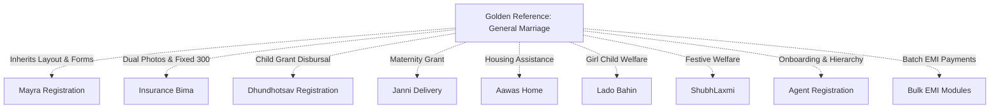

# SAF Foundation Frontend — Module-by-Module Logic & Reference Comparison

> **Golden Reference Standard**: The **General Marriage Application (`/dashboard/general-applications`)** is the primary design benchmark. Differences between modules are documented below as intentional business rules rather than architectural anomalies.

---

## 1. Golden Reference Module: General Marriage Application

- **Module Route**: `/dashboard/general-applications`
- **Sub-pages**:
  - Add: `/dashboard/general-applications/add`
  - Edit: `/dashboard/general-applications/edit/[id]`
  - List: `/dashboard/general-applications`
- **Core Components**: `ApplicationFormSections` (`Personal`, `Family`, `Address`, `Nominee`, `Agent`, `Payment`, `Document`), `PaginatedTableSection`, `EpinInputVerifier`, `RazorpayPayment`.
- **Services**: `generalApplicationsAPI` in `lib/api.ts` & `lib/services.ts`.
- **Primary Business Rules**:
  1. Age-driven dynamic category and fee calculation (`18-25`, `26-35`, `36-50`, `50+`).
  2. Physical offline booklet form number (`offlineFormNumber`) preservation.
  3. Single applicant photo upload with non-destructive edit preservation.
  4. Server-side Marriage Bond PDF generation via `/api/generate-bond-pdf`.
  5. E-PIN verification and atomic consumption during submission.

---

## 2. Comparative Analysis of All System Modules

---

### 📋 Detailed Module Breakdown

| Module Name | Route | UI / Form Pattern | Business-Specific Logic & Differences | PDF Engine | Status |
| :--- | :--- | :--- | :--- | :--- | :--- |
| **General Marriage** | `/dashboard/general-applications` | Golden Reference Standard (7 Form Cards, Bilingual, Paginated Table) | Age slab pricing, E-PIN burning, dual form numbers. | `/api/generate-bond-pdf` | **IMPLEMENTED** |
| **Mayra Registration** | `/dashboard/mayra-registration` | Identical to General Marriage | Focuses on maternal uncle's gift commitments for niece/nephew marriage. Installment tracking sub-page. | `/api/generate-mayra-bond-pdf` | **IMPLEMENTED** |
| **Mayra Congratulations** | `/dashboard/mayra-congratulations` | Form + Receipt Table | Disbursal gift tracking with payment receipts. | `/api/generate-mayra-congratulations-pdf` | **IMPLEMENTED** |
| **Insurance Bima** | `/dashboard/general-applications-insurance`| Dual Photo Dropzone (Applicant + Nominee) | Fixed ₹300 monthly installment. Dual photo fitting inside inner border box. | `/api/generate-insurance-bond-pdf` | **IMPLEMENTED** |
| **Suraksha Bima Yojana**| `/dashboard/suraksha-bima-yojana` | Standard Scheme Form | Variant insurance scheme with monthly tracking. | `/api/generate-suraksha-bima-pdf` | **IMPLEMENTED** |
| **Janni Delivery** | `/dashboard/janni-delivery` | Standard Scheme Form + Grant Tab | Maternity welfare grant with institutional delivery certificate attachments. | `/api/generate-janni-bond-pdf` | **IMPLEMENTED** |
| **Aawas / Housing** | `/dashboard/aawas` | Standard Scheme Form | Housing assistance grant application. | `/api/generate-financial-help-pdf` | **IMPLEMENTED** |
| **Lado Bahin** | `/dashboard/lado-bahin` | Standard Scheme Form | Girl-child financial welfare scheme. | `/api/generate-lado-bahin-bond-pdf` | **IMPLEMENTED** |
| **Dhundhotsav** | `/dashboard/dhundhotsav` | Child-focused Form | Infant celebration grant with child DOB validation. | `/api/generate-dhundhotsav-bond-pdf` | **IMPLEMENTED** |
| **ShubhLaxmi** | `/dashboard/shubh-laxmi` | Festive Welfare Form | Deepawali festive welfare assistance scheme. | `/api/generate-financial-help-pdf` | **IMPLEMENTED** |
| **Balika Loan** | `/dashboard/loan-application` | Financial Form + Loan Terms | Loan disbursement tracking, interest calculation, guarantor details. | `/api/generate-girl-loan-pdf` | **IMPLEMENTED** |
| **Financial Help** | `/dashboard/financal-help` | Grant Application Form | Emergency medical/calamity financial grants. | `/api/generate-financial-help-pdf` | **IMPLEMENTED** |
| **Marriage Congratulations**| `/dashboard/marriage-congratulations`| Gift Disbursal Table | Post-marriage gift disbursal & sewing machine distribution tracking. | `/api/generate-marriage-congratulations-pdf`| **IMPLEMENTED** |
| **Agent Registration** | `/dashboard/agent-registration` | Multi-step Agent Onboarding | Agent hierarchy (Senior/Junior), commission percentage, identity card generator. | `/api/generate-agent-pdf` | **IMPLEMENTED** |
| **Agent Permission** | `/dashboard/agent-permission` | Granular Permission Grid | Checkbox matrix for granting module-level permissions per agent. | N/A | **IMPLEMENTED** |
| **Agent Commission** | `/dashboard/agent-commission` | Financial Disbursal Ledger | Calculates monthly agent commission based on collected member EMIs. | N/A | **IMPLEMENTED** |
| **Agent Commission Report**| `/dashboard/agent-commission-report`| Performance Analytics | Filterable agent earnings and performance breakdown. | N/A | **IMPLEMENTED** |
| **Bulk Marriage EMI** | `/dashboard/bulk-marriage-emi` | Multi-Row Batch Table | Collects multiple member EMIs in a single transaction with master receipt. | `/api/generate-bulk-marriage-emi-pdf` | **IMPLEMENTED** |
| **Bulk Mayra EMI** | `/dashboard/bulk-mayra-emi` | Multi-Row Batch Table | Bulk EMI collection engine for Mayra accounts. | `/api/generate-bulk-mayra-emi-pdf` | **IMPLEMENTED** |
| **Bulk Insurance EMI**| `/dashboard/bulk-suraksha-bima-emi`| Multi-Row Batch Table | Bulk EMI collection engine for Insurance accounts. | `/api/generate-bulk-suraksha-bima-emi-pdf` | **IMPLEMENTED** |
| **E-PIN Management** | `/dashboard/epin-management` | Inventory & Generation Modals | Batch E-PIN generator, pool allocator, audit trail, live burning logs. | N/A | **IMPLEMENTED** |
| **Payment Management**| `/dashboard/payment-management` | Centralized Cash-Flow Ledger | Unified financial overview across cash, Razorpay, UPI, and bank transfers. | N/A | **IMPLEMENTED** |
| **System Settings** | `/dashboard/settings/configuration`| Dynamic Config Dashboard | Real-time feature flag toggles, age slab price editors, scheme metadata manager. | N/A | **IMPLEMENTED** |
| **Disability Cycle** | `/dashboard/disability-cycle` | Standard Scheme Form | Disabled via non-destructive feature flag in `module-registry.ts`. | `/api/generate-disability-cycle-pdf` | **DISABLED** |
| **Sewing Machine Camp**| `/dashboard/sewing-machine` | Standard Scheme Form | Disabled via non-destructive feature flag in `module-registry.ts`. | `/api/generate-sewing-machine-pdf` | **DISABLED** |
| **Pension Yojana** | `/dashboard/pension-yojana` | Standard Scheme Form | Disabled via non-destructive feature flag in `module-registry.ts`. | `/api/generate-pension-pdf` | **DISABLED** |
