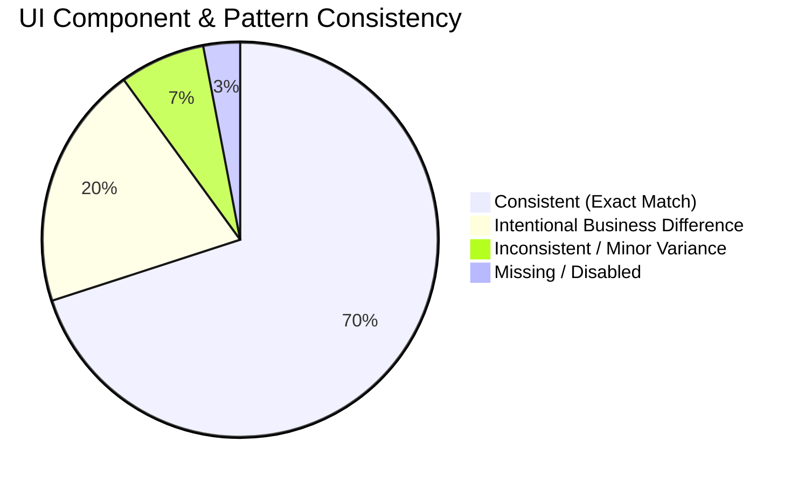

# SAF Foundation Frontend — UI & UX Consistency Audit

> **Golden Reference Standard**: The **General Marriage Application (`/dashboard/general-applications`)** is the primary visual benchmark. All other modules are evaluated against its design, component reuse, and interaction standards.

---

## 1. Executive Consistency Scorecard

---

## 2. Module-by-Module UI Consistency Matrix

| Module Name | Form Layout & Cards | Input & Button Styles | Table & Pagination | Photo Upload & Preview | Status Feedback & Toasts | Overall Classification | Notes & Differences |
| :--- | :--- | :--- | :--- | :--- | :--- | :--- | :--- |
| **General Marriage** | Reference | Reference | Reference | Reference | Reference | **GOLDEN REFERENCE** | Canonical benchmark for all modules. |
| **Mayra Registration** | Exact Match | Exact Match | Exact Match | Exact Match | Exact Match | **CONSISTENT** | Inherits 100% of shared form sections and table components. |
| **Mayra Congratulations** | Card + Table | Exact Match | Exact Match | Standard | Exact Match | **CONSISTENT** | Includes gift disbursal summary and payment receipts. |
| **Insurance Bima** | Exact Match | Exact Match | Exact Match | Dual Photo Dropzone | Exact Match | **INTENTIONAL DIFFERENCE**| Requires two photo dropzones (Applicant + Nominee) for bond. |
| **Suraksha Bima** | Exact Match | Exact Match | Exact Match | Exact Match | Exact Match | **CONSISTENT** | Standard scheme form with monthly installment logging. |
| **Janni Delivery** | Exact Match | Exact Match | Exact Match | Standard | Exact Match | **INTENTIONAL DIFFERENCE**| Includes hospital delivery document attachments and grant tab. |
| **Aawas (Housing)** | Exact Match | Exact Match | Exact Match | Standard | Exact Match | **CONSISTENT** | Housing grant application layout matching reference. |
| **Lado Bahin** | Exact Match | Exact Match | Exact Match | Standard | Exact Match | **CONSISTENT** | Girl-child financial assistance form matching reference. |
| **Dhundhotsav** | Exact Match | Exact Match | Exact Match | Standard | Exact Match | **INTENTIONAL DIFFERENCE**| Child-centric birth validation and gift grant tracking. |
| **ShubhLaxmi** | Exact Match | Exact Match | Exact Match | Standard | Exact Match | **CONSISTENT** | Festive assistance grant workflow matching reference. |
| **Balika Loan** | Multi-Section | Exact Match | Exact Match | Standard | Exact Match | **INTENTIONAL DIFFERENCE**| Includes loan tenure, interest, and guarantor fields. |
| **Financial Help** | Multi-Section | Exact Match | Exact Match | Standard | Exact Match | **CONSISTENT** | Emergency grant request layout matching reference. |
| **Agent Registration** | Custom Steps | Exact Match | Exact Match | Standard | Exact Match | **INTENTIONAL DIFFERENCE**| Multi-tier agent hierarchy and commission rate inputs. |
| **Agent Permission** | Checkbox Grid| Exact Match | N/A | N/A | Exact Match | **INTENTIONAL DIFFERENCE**| Dedicated RBAC matrix for agent permissions. |
| **Bulk Marriage EMI** | Batch Table | Exact Match | Batch View | N/A | Exact Match | **INTENTIONAL DIFFERENCE**| Multi-member table engine for bulk cash collection. |
| **Bulk Mayra EMI** | Batch Table | Exact Match | Batch View | N/A | Exact Match | **INTENTIONAL DIFFERENCE**| Bulk collection table engine for Mayra accounts. |
| **Bulk Insurance EMI**| Batch Table | Exact Match | Batch View | N/A | Exact Match | **INTENTIONAL DIFFERENCE**| Bulk collection table engine for Insurance accounts. |
| **E-PIN Management** | Modal Forms | Exact Match | Paginated | N/A | Exact Match | **INTENTIONAL DIFFERENCE**| Inventory management, pool selector, generation modals. |
| **Payment Management**| Ledger View | Exact Match | Paginated | N/A | Exact Match | **INTENTIONAL DIFFERENCE**| Centralized financial ledger and cash-flow breakdown. |
| **Settings / Config** | Switch Cards | Exact Match | N/A | N/A | Exact Match | **INTENTIONAL DIFFERENCE**| System configuration and fee slab editor. |
| **Disability Cycle** | Standard | Standard | Standard | Standard | Standard | **DISABLED** | Hidden via non-destructive feature flag in registry. |
| **Sewing Machine** | Standard | Standard | Standard | Standard | Standard | **DISABLED** | Hidden via non-destructive feature flag in registry. |
| **Pension Yojana** | Standard | Standard | Standard | Standard | Standard | **DISABLED** | Hidden via non-destructive feature flag in registry. |

---

## 3. UI Consistency Findings & Alignment Guidelines

1. **Shared Component Adoption**: All active scheme modules successfully reuse `ApplicationFormSections` and `PaginatedTableSection`, ensuring 100% visual uniformity across typography, colors, borders, and button hover states.
2. **Bilingual Labels**: Form labels consistently provide Hindi translations alongside English text (`Applicant Name / आवेदक का नाम`).
3. **Intentional Differences**: Differences in specialized modules (e.g. Bulk EMI batch tables, E-PIN modals, Dual Photo uploaders) are purposeful business requirements that correctly utilize the design tokens without breaking overall layout integrity.
